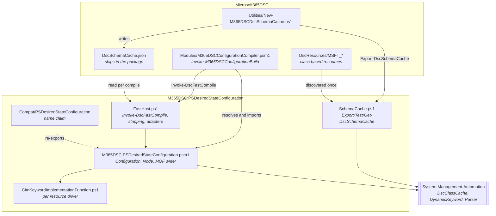
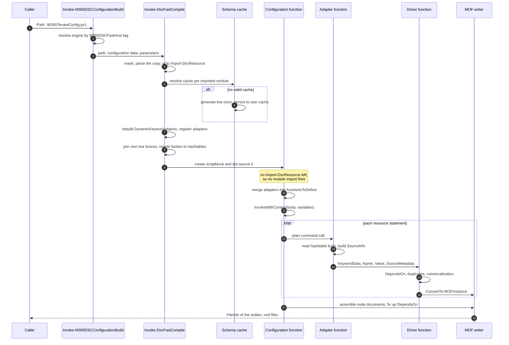
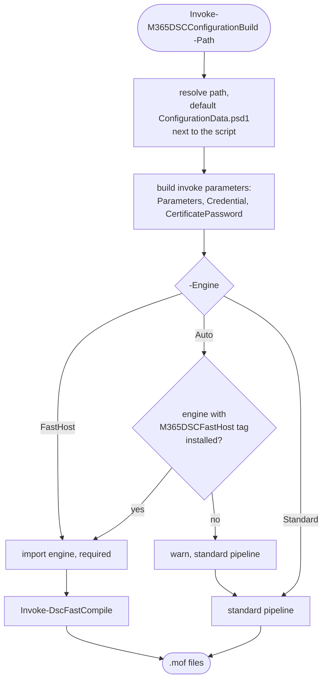
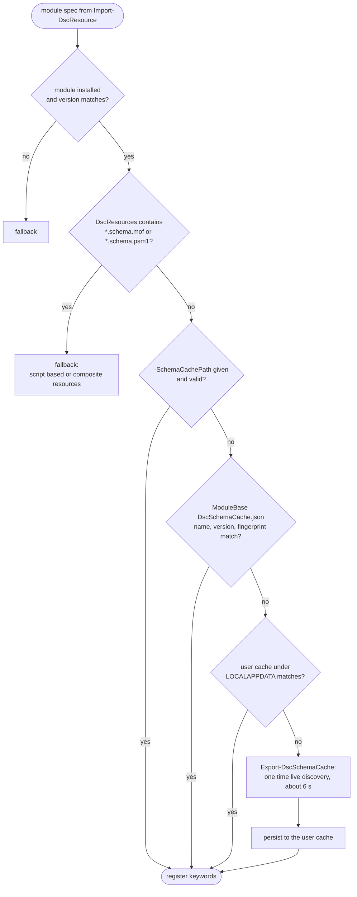
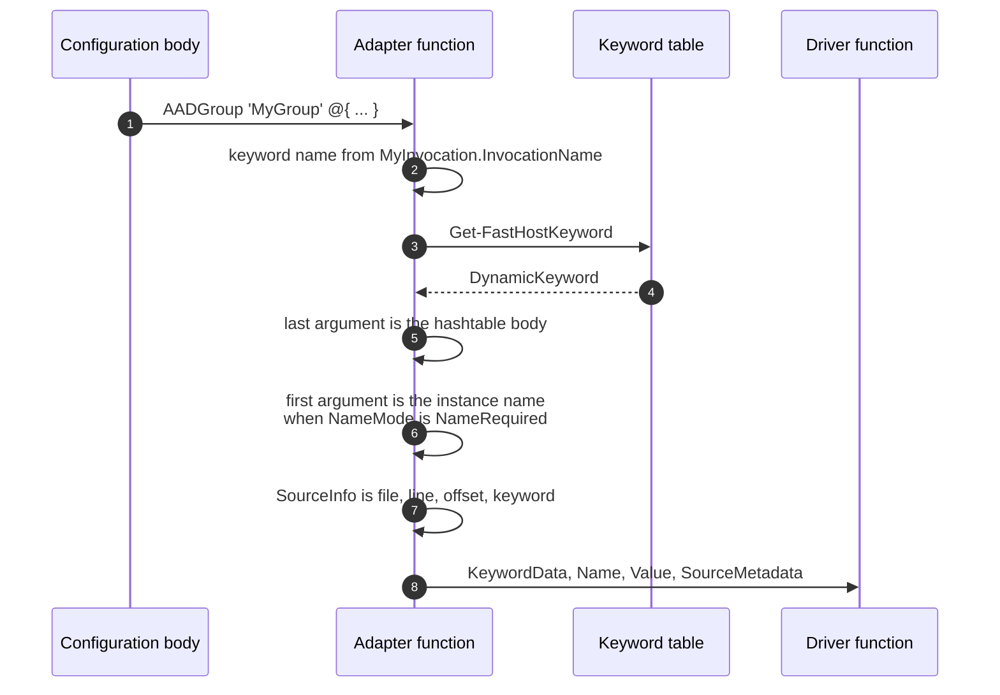
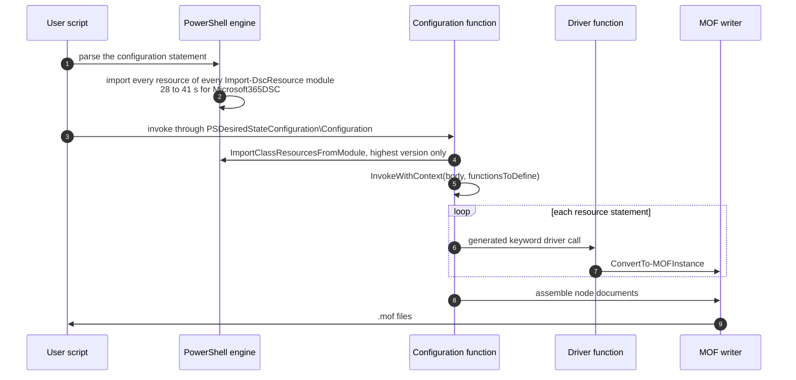
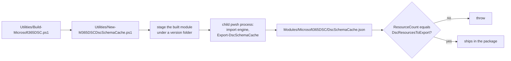

# Configuration Fast Compile Host

## Table of contents

1. [Introduction](#introduction)
2. [The two compile paths](#the-two-compile-paths)
3. [Components](#components)

    1. [On the Microsoft365DSC side](#on-the-microsoft365dsc-side)
    2. [On the engine side](#on-the-engine-side)
    3. [The module name claim](#the-module-name-claim)

4. [The configuration document](#the-configuration-document)
5. [End to end flow](#end-to-end-flow)
6. [Stage 1: Wrapper and engine resolution](#stage-1-wrapper-and-engine-resolution)
7. [Stage 2: Text transformation](#stage-2-text-transformation)

    1. [Masking instead of parsing](#masking-instead-of-parsing)
    2. [Stripping the imports](#stripping-the-imports)
    3. [Joining next line braces](#joining-next-line-braces)
    4. [Rewriting bodies to hashtable literals](#rewriting-bodies-to-hashtable-literals)

8. [Stage 3: Schema cache and keyword registration](#stage-3-schema-cache-and-keyword-registration)

    1. [Resolution order](#resolution-order)
    2. [Cache content](#cache-content)
    3. [Registration](#registration)

9. [Stage 4: Execution](#stage-4-execution)

    1. [The adapter](#the-adapter)
    2. [The driver](#the-driver)

10. [Stage 5: Document assembly and MOF emission](#stage-5-document-assembly-and-mof-emission)
11. [Difference to the classic PSDesiredStateConfiguration path](#difference-to-the-classic-psdesiredstateconfiguration-path)
12. [Fallback](#fallback)
13. [Building and shipping the schema cache](#building-and-shipping-the-schema-cache)
14. [What to take into account](#what-to-take-into-account)
15. [Running it by hand](#running-it-by-hand)

    1. [Compile an export](#compile-an-export)
    2. [Compile a script that only declares a configuration](#compile-a-script-that-only-declares-a-configuration)
    3. [Keep the cache honest](#keep-the-cache-honest)
    4. [When something looks wrong](#when-something-looks-wrong)

## Introduction

A tenant export is one PowerShell script. `M365TenantConfig.ps1` declares a single `Configuration`
block, and inside it sit as many resource instances as the tenant happens to have, which for a real
customer is regularly several hundred. Between that script and anything the Local Configuration
Manager can act on stands one step: compiling it into MOF documents.

Almost nothing about that step is genuinely hard work. Writing a few hundred instances of MOF text is
milliseconds. What costs real time is DSC resource discovery. Before the parser can accept
`AADGroup 'MyGroup' { ... }` as a resource statement, somebody has to have told the engine what an
`AADGroup` is, and the classic way of telling it is to import all 530 plus class based resources of
Microsoft365DSC. The engine does that while parsing, then the `Configuration` function does it again
at runtime, and a compile that produces a few hundred kilobytes of text takes 30 to 90 seconds.

The fast compile host removes that cost by never asking the question. It reads the keyword
definitions out of a JSON cache that was written once at build time, keeps the resource module out of
the process entirely, and produces byte identical MOF. `Invoke-M365DSCConfigurationBuild` is the
command Microsoft365DSC exposes for it, and it picks the fast path on its own when the engine is
installed.

This document follows a configuration document from that command to the written `.mof`, names the
component that owns each step, and points out where the fast path and the classic one part ways. It
does not walk through individual functions.

## The two compile paths

Both paths run the same compiler and end in the same MOF writer. The one thing they disagree about is
where resource keywords come from, and everything else in the table follows from that.

| | Classic path | Fast compile path |
| --- | --- | --- |
| Keyword source | Live import of every class based resource in the module | JSON schema cache holding the same keyword definitions |
| Parse time cost | The parser sees `Import-DscResource` and imports the module while parsing, 28 to 41 seconds for Microsoft365DSC | The statement is removed before the text is ever parsed for real |
| Runtime cost | The `Configuration` function imports the same modules a second time | No import at all |
| Resource statement | A real `DynamicKeyword` the parser recognizes | An ordinary command call routed to an adapter function |
| Property block | The parser reads it as a hashtable, because the keyword declares `BodyMode = Hashtable` | Rewritten to a hashtable literal in the text |
| MOF validation | `ValidateInstanceText` runs against the live CIM classes | Skipped unless `-ValidateMof` is passed |
| Typical wall clock | 30 to 90 seconds per configuration | Around 0.2 seconds per configuration |

**Important.** The saving has nothing to do with MOF generation. Producing the text is not the
expensive part. The saving is in never paying for resource discovery, which in a module of this size
dwarfs everything else a compile does, and which the classic path pays twice per run.

## Components



### On the Microsoft365DSC side

`Modules/Microsoft365DSC/Modules/M365DSCConfigurationCompiler.psm1` is a nested module of the
Microsoft365DSC manifest and it is deliberately thin. `Test-M365DSCFastCompileAvailable` answers
whether a capable engine is installed, and `Invoke-M365DSCConfigurationBuild` compiles a script,
through the fast host when it can and through the standard pipeline when it cannot. Neither command
knows anything about MOF. They resolve an engine, hand the work over and pass the results back.

The keyword cache the fast host reads, `Modules/Microsoft365DSC/DscSchemaCache.json`, is generated at
build time by `Utilities/New-M365DSCDscSchemaCache.ps1`. It is gitignored, so a working tree that was
never built does not carry one and a compile against that tree pays for a live generation instead.

### On the engine side

The engine package holds the compiler plus a compatibility module of the same version that exists
only to own a name.

| File | Responsibility |
| --- | --- |
| `M365DSC.PSDesiredStateConfiguration.psm1` | `Configuration` and `Node` keywords, node state, MOF instance text, document assembly, file writing |
| `FastHost.ps1` | `Invoke-DscFastCompile`, text transformation, keyword registration, adapter functions |
| `SchemaCache.ps1` | `Export-DscSchemaCache`, `Test-DscSchemaCache`, cache lookup and fingerprinting |
| `CimKeywordImplementationFunction.ps1` | The driver that validates and canonicalizes one resource instance and emits its MOF text |
| `Compat/PSDesiredStateConfiguration` | Carries the legacy module name and forwards to the engine |

None of it is compiled code. All resource discovery is delegated to `DscClassCache`, which already
ships inside `System.Management.Automation` on Windows PowerShell 5.1 and PowerShell 7 alike, so the
same script serves both editions.

### The module name claim

**Important.** Which module compiles your configuration is not decided by which module you imported.
The parser rewrites `Configuration Foo { ... }` into a function whose body the engine generates, and
that generated body opens with `Import-Module PSDesiredStateConfiguration` and closes with a call to
the module qualified name `PSDesiredStateConfiguration\Configuration`. Both are resolved by module
name at the moment the configuration runs. Whoever holds the name at that moment owns the compile.

The engine takes the name twice, because those two lines resolve through different mechanisms.
`Assert-DscConfigurationShim` assigns the engine's own `Configuration` function to the global function
name `PSDesiredStateConfiguration\Configuration`, and re-asserts it after every parse, because parsing
a configuration statement makes the engine load the inbox module by file path and quietly take the
name back. The prologue import is covered differently. Importing the engine also imports the bundled
compatibility module and prepends its `Compat` folder to `$env:PSModulePath`, so
`Import-Module PSDesiredStateConfiguration` finds a module that forwards to the engine already in
memory rather than the inbox 1.1 or gallery 2.x module.

A consumer that overwrites `$env:PSModulePath` after importing the engine has to put that folder
back. Nothing errors when it is missing. The compile simply falls through to the other module, gets
slow again and writes MOF that no longer compares byte for byte.

## The configuration document

`Export-M365DSCConfiguration` writes a script of this shape:

```powershell
param ()

Configuration M365TenantConfig
{
    param ()

    $OrganizationName = $ConfigurationData.NonNodeData.OrganizationName

    Import-DscResource -ModuleName 'Microsoft365DSC'

    Node localhost
    {
        AADGroup 'MyGroup'
        {
            DisplayName   = 'My Group'
            MailNickname  = 'mygroup'
            Ensure        = 'Present'
            ApplicationId = $ConfigurationData.NonNodeData.ApplicationId
        }
    }
}

M365TenantConfig -ConfigurationData .\ConfigurationData.psd1
```

Three details of that shape drive everything the fast host does. The `Import-DscResource` statement
is the line that makes the classic path expensive, and it is the first thing to go. Resource
statements put their opening brace on the next line, which is fine while the parser knows the keyword
and a problem the moment it does not. And the script ends by invoking its own configuration, so the
script performs the compilation, not the caller. That last one is easy to miss and it changes how the
wrapper's parameters behave.

The sibling `ConfigurationData.psd1` carries `AllNodes` together with the `NonNodeData` values the
export substituted for tenant identifiers.

## End to end flow



## Stage 1: Wrapper and engine resolution

`Invoke-M365DSCConfigurationBuild` normalizes the inputs and decides which path to take.



An engine qualifies when its manifest carries the PSData tag `M365DSCFastHost`. The wrapper takes the
highest installed version and imports it by manifest path with `-Force -Global`, after removing any
instance already loaded from a different module base. Two live instances would each keep their own
keyword table and fast host state, and the compile would silently run against whichever one won the
name claim.

The standard branch just runs the script. It pushes into the script directory first so the relative
paths in the trailer resolve, and it sets `$Global:PSDscFastCompileActive` for the duration, which is
the flag anything wrapping a build can read to tell that a compile is in progress.

`-ConfigurationName` selects the branch that dot sources the script and then invokes the named
configuration itself. That is the shape of the example files under `Examples/`, which declare a
configuration and stop there.

**Important.** For an exported script, the trailer wins, not your parameters. The last line of
`M365TenantConfig.ps1` is a complete compile command in its own right:

```powershell
M365TenantConfig -ConfigurationData .\ConfigurationData.psd1
```

The fast host dot sources the script, that line runs, the configuration compiles with the arguments
written on it, and MOF files come back. Seeing files, the fast host returns them straight to the
caller and never invokes anything itself, so `-OutputPath`, `-ConfigurationData` and `-Parameters`
from the wrapper are never applied and the documents land where the trailer put them, in
`.\M365TenantConfig\localhost.mof`. Adding `-ConfigurationName` does not change this, because the
self invocation has already produced the files by the time that parameter would be read. To send an
export somewhere else, edit its trailer, for example to
`M365TenantConfig -ConfigurationData .\ConfigurationData.psd1 -OutputPath .\out`. The wrapper's own
parameters reach the configuration only for scripts that declare one without invoking it.

## Stage 2: Text transformation

The fast host never hands the original text to the parser as a configuration. It rewrites the text
four times first, and every one of those rewrites is steered by an AST taken from a masked copy
rather than from the text itself.


### Masking instead of parsing

**Important.** There is no way to look at a configuration script without triggering the import.
`Parser.ParseInput`, `Parser.ParseFile`, `[scriptblock]::Create` and even the legacy
`PSParser.Tokenize` all fire it, the last one measured at 23 seconds for a Microsoft365DSC
configuration. This is PowerShell behaving as designed, on both Windows PowerShell and PowerShell 7,
and not something a parameter can turn off. Any tool that wants the AST of a configuration first has
to make the text stop looking like one.

Masking does exactly that, and it does it without moving a single character. Every occurrence of the
word `Configuration` becomes `C0nfiguration` in a **copy** of the text. The parser no longer sees a
configuration statement, so no import runs and the parse costs about 8 milliseconds. The replacement
is the same length as the original, which is the whole trick: every extent offset the AST reports for
the masked copy points at exactly the same character in the untouched original.

### Stripping the imports

From that masked AST, `Get-StrippedConfigurationText` picks up the names of the declared
configurations and every `Import-DscResource` command. Each import contributes its `-Name`,
`-ModuleName` and `-ModuleVersion`, positionally or named, and only constant values count, meaning
string literals and array literals of string literals. A computed module name would have to be
executed to be known, and executing the script is what this whole path avoids, so such a script falls
back instead.

The import statements are then cut out of the original text by extent. What remains is a script with
no DSC specific syntax left in it at all.

### Joining next line braces

Now that the parser no longer knows the keywords, the export style below stops being one statement:

```powershell
AADGroup 'MyGroup'
{
    DisplayName = 'My Group'
}
```

The parser reads a command call, then an unrelated scriptblock, and the resource is lost.
`Merge-FastHostResourceStatements` finds those pairs in the masked AST and splices the gap between
them down to a single space, which makes the block the last argument of the command again. Two shapes
qualify. One is the resource statement `KeywordName [InstanceName]`. The other is a nested CIM
instance inside a resource body, written as `PropertyName = KeywordName`, which despite the equals
sign is not an assignment at all but a single command whose three elements are the property name, a
literal `=` and the keyword.

### Rewriting bodies to hashtable literals

**Important.** DSC registers resource keywords with `BodyMode = Hashtable`, so on the classic path
the parser reads a resource body as a hashtable and a property is free to be called `User`,
`Settings` or `Script`. Leave that same body as a scriptblock and those names are live built in
keywords again, which turns an ordinary property assignment into a syntax error.

`Convert-FastHostBodyToHashtable` closes that gap by inserting an `@` in front of every keyword body,
turning `{ ... }` into `@{ ... }` and adding a separator where the source had none. The result is a
script the parser can take at face value, in which every resource is a command call whose last
argument happens to be a hashtable literal.

## Stage 3: Schema cache and keyword registration

For each module named by a stripped import, the fast host resolves a module and then a cache.



### Resolution order

1. Paths given through `-SchemaCachePath`.
2. `<ModuleBase>\DscSchemaCache.json`, shipped inside the resource module package.
3. `%LOCALAPPDATA%\M365DSC.PSDesiredStateConfiguration\SchemaCache\<Name>_<Version>_<fingerprint>.json`,
   written after a live generation.
4. Live generation, then persisted to 3.

A cache has to earn its place before any of its keywords are used. Its format version may not be
newer than the reader knows, its module name and version have to match, and so does its fingerprint.
That fingerprint is `fileCount:maxLastWriteTimeUtcTicks` over `*.psm1`, `*.psd1` and `*.mof` below the
module base, which lets any added, removed or rewritten file invalidate the cache without hashing a
single byte at compile time. When accuracy matters more than speed, `Test-DscSchemaCache -Detailed`
re-hashes every file recorded in `sourceHash`, which is what belongs in a CI drift gate.

### Cache content

The cache is a JSON serialization of the very `DynamicKeyword` definitions a live import would have
produced. It records the keyword name, the resource name, the implementing module and version, the
name and body modes, and for every property its type constraint, its key and mandatory flags, its
allowed values and its value map. Embedded complex types sit in the same flat list as ordinary no
name keywords. Value maps are arrays of key and value pairs rather than JSON objects, because DSC
permits an empty string as a map key and no JSON object can carry that portably.

For Microsoft365DSC the shipped cache is roughly 3.6 MB and covers 531 resources in 998 keywords.

### Registration

`Register-DscCachedKeywords` rehydrates each entry into a real `DynamicKeyword` object and stores it
in a case insensitive dictionary. Every keyword gets the same shared adapter scriptblock, registered
twice, under the bare name and under the `Microsoft365DSC\<Keyword>` qualified name, because a
configuration body may call it either way.

Registration is remembered per module and version for the life of the session, so a second compile in
the same process reuses the keyword table and touches no JSON.

**Important.** These keywords live only in the fast host's own dictionary. They never enter the
parser keyword table, and no CIM classes are registered with the MI layer. Two consequences follow
from that and both show up later in this document. `ConvertTo-MOFInstance` has to consult the fast
host dictionary before falling back to `[DynamicKeyword]::GetKeyword()`, and MOF validation has
nothing to validate against, so it is skipped.

## Stage 4: Execution

`Invoke-DscFastCompileBody` creates a scriptblock from the transformed text and dot sources it inside
the script directory. A scriptblock built from text carries no file name, which would leave every
`SourceInfo` in the document pointing nowhere, so the real script path is handed to the fast host
separately and the adapter uses it instead.

Because the trailer of an exported configuration invokes the configuration itself, the dot source is
what performs the compile, and `FileInfo` objects come back from it. Only when nothing comes back
does the fast host resolve a configuration name, from `-ConfigurationName` or from the single declared
configuration, and invoke it with the caller's parameters, configuration data and output path.

Inside the engine's `Configuration` function the fast path is the classic path with two edits. The
import loop finds `ResourceModuleTuplesToImport` empty and does nothing, since the statements that
would have filled it were removed. And when the fast host is active, its adapters plus four accessor
functions are merged into `functionsToDefine`, the same dictionary real keywords would have been
added to, which is then handed to `Body.InvokeWithContext` together with `ConfigurationData`,
`AllNodes`, `MyTypeName`, `IsMetaConfig` and the configuration parameters.

Everything after that point is shared code. Node state, `DependsOn` fix up, conflict detection,
credential encryption and document assembly do not know which path fed them.

### The adapter



The property block arrives at the adapter as a hashtable PowerShell has already evaluated in the
caller's scope, which is why `$ConfigurationData`, `$AllNodes`, `$Node`, script parameters and user
variables behave exactly as they do on the classic path. The adapter validates nothing beyond the
shape of its arguments. Its entire job is to turn a command call back into the argument set a keyword
driver expects.

### The driver

`CimKeywordImplementationFunction.ps1` is the single driver both paths use. Per resource instance it:

1. Builds the resource id `[Keyword]InstanceName` and records `SourceInfo`, `ModuleName` and
   `ModuleVersion`.
2. Validates the `DependsOn` references, merges them with an outer composite resource's `DependsOn`,
   and registers them in the per node resource table.
3. Rejects a duplicate resource id in the same node.
4. Merges `PsDscRunAsCredential` from the configuration, and errors when both sides set it.
5. Copies every user supplied value into a new hashtable with canonically cased property names,
   checking allowed values, ranges and mandatory properties, and translating value map entries to
   their MOF representation.
6. Accumulates the key property values and runs conflict detection across instances that share them.
7. Calls `ConvertTo-MOFInstance`, which produces the MOF text for the instance and returns its alias.

Problems are reported through the configuration error counter rather than by throwing, so one compile
tells you about every broken resource instead of only the first one.

## Stage 5: Document assembly and MOF emission

When the top level `Configuration` invocation ends, the engine turns the collected instances into
documents. It rewrites `DependsOn` into instance aliases, checks that every referenced resource
exists, resolves module versions, hunts for dependency cycles, appends the
`OMI_ConfigurationDocument` instance and writes one document per node.

`Write-NodeMOFFile` calls `Test-MofInstanceText` before writing. On the fast path that call returns
immediately unless `-ValidateMof` was passed, because MI validation needs the live CIM classes this
path never registers. `-ValidateMof` brings the check back at the price of the import the fast path
exists to avoid, which makes it a diagnostic switch rather than something to leave on.

The file goes through a single writer as UTF-8 without a byte order mark, and the document body
carries LF line endings because the instance text is assembled with `\n`. There is no generated by
banner and there are no `Author`, `GenerationDate` or `GenerationHost` fields. Together that makes the
same configuration compile to the same bytes on every run, machine, user and PowerShell edition,
which is what allows the two paths to be compared against each other at all. Property order inside an
instance is the one thing that still moves, since it follows hashtable enumeration.

Compilation state is torn down in a `finally` block. The fast host flags are cleared and
`[DynamicKeyword]::Reset()` runs, so a session that compiles one configuration after another does not
accumulate keyword state from the previous run.

## Difference to the classic PSDesiredStateConfiguration path



The classic path is not a second compiler. It is the same `Configuration` function, the same driver
and the same writer, reached with keywords that came from a live import instead of a cache. Four
things differ.

- **Discovery happens twice.** Once while the parser processes the configuration statement, and once
  when the `Configuration` function walks `ResourceModuleTuplesToImport`.
- **Keywords are real parser keywords.** The parser knows `AADGroup`, accepts the next line brace and
  reads the body as a hashtable by itself, so none of the text transformation is needed.
- **CIM classes are registered**, which is what lets `ValidateInstanceText` check the assembled
  document.
- **Composite and script based resources work.** They rely on the engine's own import. The fast path
  takes that away.

Run the same script on the inbox 1.1 or gallery 2.x module and it still compiles, at the same cost,
but that module has no fast host, no schema cache and no deterministic writer, and its documents
arrive stamped with a banner and volatile metadata fields. Which module you get is settled by the
name claim described earlier, not by which module you imported last.

## Fallback

The fast host would rather be slow than be wrong. Whenever it cannot guarantee that its result
matches what the classic path would have produced, it degrades to standard compilation and warns with
the reason.

| Trigger | Reason |
| --- | --- |
| `Import-DscResource` with non constant arguments | The module set cannot be determined without executing the script |
| `-Name` without `-ModuleName` | Would require scanning every installed module |
| The named module is not installed, or not in the requested version | Nothing to resolve a cache against |
| The module contains `*.schema.mof` or `*.schema.psm1` under `DscResources` | Script based and composite resources need the engine's own import |
| No usable schema cache and none can be generated | Nothing to register keywords from |

`-NoFallback` turns each of these into a terminating error. Continuous integration should use it,
because a stale cache that quietly degrades into a 90 second compile still passes, and nobody looks
at a passing job. The QA example gate takes the same stance by asserting
`Test-M365DSCFastCompileAvailable` and passing `-Engine FastHost`.

## Building and shipping the schema cache



`Export-DscSchemaCache` resets the keyword state, snapshots the default keywords, imports the
module's class based resources once through `DscClassCache::ImportClassResourcesFromModule`, and
serializes everything that was not already a default. That discovery costs about 6 seconds for
Microsoft365DSC. This is a build step during the module build, not a compile step on the local machine.

Two decisions in the build wrapper are worth knowing about. It runs the export in a **child process**
whose `PSModulePath` contains nothing but the staged module, so the one time import neither pollutes
the calling session nor accidentally discovers an installed Microsoft365DSC from somewhere else on
the machine. And it compares the reported `ResourceCount` against the number of resources the
manifest exports and throws when they disagree, which is what catches a cache generated against a
half built module tree.

**Important.** Generate the cache **after** any build step that adds or trims files in the module
tree. The fingerprint is a file count and the newest write time, so a file operation that happens
later invalidates a cache that was perfectly correct when it was written, and the next compile
quietly regenerates it instead of using the shipped one.

## What to take into account

**The cache is the contract, not the resource files.** The fast host compiles against
`DscSchemaCache.json`. A property that exists in the source tree but not in the cache does not exist
as far as compilation is concerned, and the fingerprint check is the only thing keeping the two
honest.

**Composite and script based resources are out of scope.** The fast path is fast because it can skip
the engine import. A module that genuinely needs that import gets the classic path, by design, and
that is not a gap waiting to be closed.

**Validation is traded away deliberately.** MOF validation is off by default. `-ValidateMof` brings
it back for a diagnostic run, and the real coverage comes from compiling every example in CI rather
than from validating each document.

**One engine instance per session.** The wrapper removes a mismatched instance before importing. Two
loaded copies mean two keyword tables and two sets of fast host state, and the compile runs against
whichever one won the name claim, which is not a thing you want to debug.

**Determinism is a feature to preserve.** Reintroduce a volatile field, a banner or a platform
dependent encoding and the two paths stop comparing byte for byte, which removes the main evidence
that the fast path is still equivalent to the slow one.

## Running it by hand

### Compile an export

```powershell
Test-M365DSCFastCompileAvailable

Invoke-M365DSCConfigurationBuild -Path .\M365TenantConfig.ps1
```

The documents land in `.\M365TenantConfig\localhost.mof`, because the trailer of the exported script
does not name an output path and the engine defaults it to the configuration name. Change the trailer
when you want them elsewhere. Add `-Engine Standard` to force the classic path, which is worth doing
once when a compile produces something you did not expect, since a result that differs between the
two paths is a genuine bug and a result that matches is not.

### Compile a script that only declares a configuration

This is the shape the example files use. You can use it with the wrapper's own parameters.

```powershell
Invoke-M365DSCConfigurationBuild -Path .\Example.ps1 `
    -ConfigurationName 'Example' `
    -ConfigurationData $configurationData `
    -OutputPath .\out `
    -Engine FastHost
```

### Keep the cache up-to-date

```powershell
# Needed once for a module that ships without a cache.
Export-DscSchemaCache -ModuleName Microsoft365DSC

# Catches a module that changed after its cache was written.
Test-DscSchemaCache -ModulePath $moduleBase -CachePath $cacheJson -Detailed

# Fails instead of degrading to a slow compile.
Invoke-DscFastCompile -Path .\M365TenantConfig.ps1 -NoFallback
```

In this repository the cache is a build artifact. After changing a resource class or a
`settings.json`, run `Utilities/Build-Microsoft365DSC.ps1`, which regenerates
`DscSchemaCache.json` as part of the build. Compiling against a tree you have not rebuilt is the most
common reason a property you just added does not show up in the MOF.

### When something looks wrong

| Symptom | Cause |
| --- | --- |
| Compiles are slow and the MOF carries `GenerationDate` | Compilation went through the inbox or gallery module. `(Get-Module PSDesiredStateConfiguration).Path` must point at the engine's `Compat` folder |
| `Falling back to standard compilation` | See the fallback table; the warning names the trigger |
| A resource property change is ignored | Stale schema cache. Rebuild the module, or pass `-Force` |
| `Undefined DSC resource` inside the fast host | The configuration uses a statement shape the transformation does not cover. A fallback warning normally precedes this |
| `-OutputPath` had no effect | The script invokes its own configuration, so the trailer decided. Edit the trailer, or compile a script that only declares the configuration |
