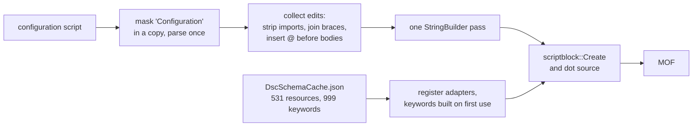

# From Script-Based to Class-Based, Part 3: Compiling Configurations, the Fast Host, and DSCv3

<b>by <a href="https://www.linkedin.com/in/fabien-tschanz">Fabien Tschanz</a> 
October 7th, 2026</b>

 
 

## Introduction

[Part 1](./class-based-resources.md) told the story of converting every Microsoft365DSC resource to a class, and [part 2](./class-based-resources-part-2.md) got the module to import, parse and compare fast again. This last part is about the one thing that got *dramatically* worse when the MOF files disappeared, the one thing we genuinely did not see coming, and the one I am proudest of having fixed: compiling a configuration.

A tenant export is a PowerShell script with a `Configuration` block and, for a real customer, several hundred resource instances inside it. Between that script and anything the Local Configuration Manager can act on stands exactly one step, compiling it into MOF documents. With script-based resources that step took a few seconds and nobody ever thought about it. With class-based resources it took 30 to 55 seconds for a real export and 40 to 50 seconds even for a one-resource example, since the DSC engine now had to create a thousand .NET types before it could recognize a single resource statement, and it did so on every compile.

The answer turned out to be a fork of `PSDesiredStateConfiguration`, which we maintain and publish as `M365DSC.PSDesiredStateConfiguration`, with a "fast compile host" inside it that never asks the engine what a resource is. I will walk you through why the stock engine cannot be fixed from the outside, how the fast host works, the tricks it relies on and the dead ends we hit on the way, how we proved that its output is equivalent, what the numbers look like on my laptop and roughly what you should expect on a CI runner. Then we will look at what DSCv3 makes of the whole thing, and close with the final numbers of the project.

## Table of Contents

1. [Issue #5: Compiling a configuration became the slow part](#issue-5-compiling-a-configuration-became-the-slow-part)
2. [Why the stock engine cannot be fixed from outside](#why-the-stock-engine-cannot-be-fixed-from-outside)
3. [A fork, and a module that claims a name](#a-fork-and-a-module-that-claims-a-name)
4. [The tricks behind the fast host](#the-tricks-behind-the-fast-host)
5. [Dead ends](#dead-ends)
6. [Proving the output is the same](#proving-the-output-is-the-same)
7. [The numbers, and what to expect on a CI runner](#the-numbers-and-what-to-expect-on-a-ci-runner)
8. [Rebuilding the examples on top of it](#rebuilding-the-examples-on-top-of-it)
9. [DSCv3: what 3.2.3 makes of the module](#dscv3-what-323-makes-of-the-module)
10. [The project in numbers](#the-project-in-numbers)
11. [What this means for you](#what-this-means-for-you)
12. [Wrapping up](#wrapping-up)

## Issue #5: Compiling a configuration became the slow part

When PowerShell parses the line `Import-DscResource -ModuleName Microsoft365DSC` in a script, the DSC engine imports the module right there and then, *at parse time*, and builds a `DynamicKeyword` for every resource it finds. With script-based resources that work means reading MOF files, which is fairly cheap. With class-based resources it means .NET type creation, the same cost curve we fought in part 2, except that now it runs on every single compile instead of once per session. And once the parser is done, the generated `Configuration` function imports the very same modules a second time at runtime, just to be sure.

The first measurements in August, against the 1.26.805 class build, looked like this on my laptop:

| Step | Windows PowerShell 5.1 | PowerShell 7 |
| --- | --- | --- |
| Parsing the script (parse-time import) | 28 s | 41 s |
| First execution of the configuration (runtime import) | 38 s | 55 s |
| A second compile in the same session | 28 s | 41 s |

Between 67 and 96 seconds in a fresh process and 38 to 41 seconds for a repeat, for a script with a handful of resources in it. The repeat is as slow as the first run since the engine wipes its keyword table after every compile (`[DynamicKeyword]::Reset()`) and persists nothing whatsoever. Our example suite holds about 1,700 examples in 1,169 files, and a full QA run had been around 20 minutes with the MOF-based module. At 30 to 90 seconds per example it was suddenly a workday, not a coffee break.

I want to be honest about how that moment felt. We expected to ship the class-based module with this flaw, since compiling is the engine's job, the engine lives inside `System.Management.Automation`, and nothing about it is configurable. We had a conversion that was correct and a compile that was ten times slower, and no idea how to close the gap.

## Why the stock engine cannot be fixed from outside

Everything we tried from the outside died the same death: **there is no way to look at a configuration script without triggering the import.** `Parser.ParseInput`, `Parser.ParseFile`, `[scriptblock]::Create` and even the ancient `PSParser.Tokenize` all fire it, and tokenizing a configuration that imports Microsoft365DSC measured 23 seconds on both editions. The parser sees the `Configuration` keyword, sees `Import-DscResource` inside it, and imports the module before it hands you an AST. That is PowerShell behaving exactly as designed, on both editions, and there is no switch for it.

The obvious ideas fell one by one:

- **Narrowing `Import-DscResource -Name`** to the resources a script actually uses helps, but only so far. Importing one resource still parsed in 5.6 seconds, ten in 8.6, forty in 9.6, against 42.7 seconds for the full module, and since the keyword table is rebuilt from the class cache every time, the narrowing has to be redone per script.
- **Pre-warming the keyword table** from a JSON cache before a normal parse spent 7.9 seconds, and the parse still took 40. The engine rebuilds the table from its own class cache during the parse and simply ignores anything registered from outside.
- **Seeding the engine's class cache** through reflection worked sometimes, with a parse in 5 to 53 milliseconds, and sometimes not at all, with 26 to 42 seconds, in a pattern we never managed to make deterministic. We parked it, with some frustration.

Add to that the two modules already fighting over the name. Windows PowerShell 5.1 ships `PSDesiredStateConfiguration` 1.1 inbox under `System32`, PowerShell 7 users install 2.0.7 from the gallery, and on my laptop the PowerShell 7 installer's module folder even made Windows PowerShell resolve 2.0.7 and complain that it "requires a minimum Windows PowerShell version of '6.1'". At some point the conclusion became unavoidable: if we wanted the compile to be fast, we had to own the compiler.

## A fork, and a module that claims a name

Microsoft365DSC already had a fork of PSDesiredStateConfiguration lying around, sitting on the upstream v3.0-beta lineage, PowerShell 7 only, with resource discovery in a compiled .NET 6 subsystem. The classic LCM lives in Windows PowerShell 5.1, so that lineage could never serve both editions, and Borgquite's plea from part 1 still stood. In August we rebased the fork onto the pure-script sources of upstream **2.0.7**, deleted the compiled subsystem, and made the manifest declare both `Desktop` and `Core`. Resource discovery is delegated to `DscClassCache` inside `System.Management.Automation`, which exists on both editions, so one script module covers 5.1 and 7 with no compiled code at all. The module is published as `M365DSC.PSDesiredStateConfiguration`, carries the PSData tag `M365DSCFastHost` that Microsoft365DSC probes for, and comes down with the module dependencies.

Two things had to be true before any fast path made sense at all.

**The MOF writer had to be deterministic.** Upstream stamps every document with a banner, `Author`, `GenerationDate` and `GenerationHost`, and writes it through `Out-File` redirection, which gave us UTF-16 on 5.1 and UTF-8 on PowerShell 7. The fork has none of that. There is one writer function, no volatile fields, and since 3.1.6 UTF-16LE with a byte order mark, after we learned the hard way that the MI MOF parser decodes a document without the mark as Latin-1 and silently mangles every non-ASCII character. Determinism is not cosmetics here. It is what lets us compare the fast path against the classic path byte for byte and call any difference a bug.

**The fork had to own the name `PSDesiredStateConfiguration`.** This one genuinely surprised me, since which module compiles your configuration is *not* decided by which module you imported. The parser rewrites `Configuration Foo { ... }` into a function whose body the engine generates, and that generated prologue is hardcoded in `System.Management.Automation`. It opens with `Import-Module PSDesiredStateConfiguration` and ends with a call to the module-qualified name `PSDesiredStateConfiguration\Configuration`, and both resolve by name at the moment the configuration runs. Whoever holds the name at that moment owns the compile. Our first shim, a global function named `PSDesiredStateConfiguration\Configuration`, won at import time and got taken over mid-execution when the engine loaded the inbox module by path. The fix that shipped is a tiny compatibility module literally named `PSDesiredStateConfiguration`, bundled under `Compat/` and forwarding to the engine already in memory, with the engine prepending that folder to `PSModulePath` on import. Without the claim, a single compile lets 2.0.7 or 1.1 own `Configuration`, `Get-DscResource` and `New-DscChecksum` for the rest of the session, and the MOF stops comparing.

## The tricks behind the fast host

With the engine in our hands, `Invoke-DscFastCompile` can do what no outside tool ever could, which is compiling a configuration without importing the resource module at all. Microsoft365DSC exposes it as `Invoke-M365DSCConfigurationBuild`, which picks the fast path on its own whenever the engine is installed. The full flow is documented in [Configuration Fast Compile Host](https://github.com/Microsoft365DSC/Microsoft365DSC/blob/Dev/docs/ConfigurationFastCompileHost.md) in the repository. Here are the ideas that make it work, in the order they are applied, and I will admit that some of them still make me grin.

**Masking instead of parsing.** Every parse of a configuration triggers the import, so the fast host makes the text stop looking like a configuration. Every occurrence of the word `Configuration` becomes `C0nfiguration` in a *copy*, the parser sees no configuration statement, no import fires, and the parse costs milliseconds for a small script and 0.3 to 0.5 seconds for a 726-instance export. The replacement has exactly the same length as the original, and that is the whole trick, since every offset the AST reports for the masked copy points at precisely the same character in the untouched text. A zero instead of an O is what saved the compile.

**Stripping `Import-DscResource`.** From the masked AST the fast host reads the module names and versions off every `Import-DscResource` statement, constant values only, and cuts the statements out by extent. A computed module name would require executing the script, which is the one thing this whole path exists to avoid, so such a script falls back to the classic path with a warning.

**Joining next-line braces.** Without the keywords, the export style `AADGroup 'MyGroup'` followed by `{` on the next line stops being one statement. The parser reads a command call and an unrelated scriptblock, and the resource is lost. The fast host finds those pairs and splices the gap between them down to a single space, and the same goes for nested CIM instances written as `Property = MSFT_Type` plus a block, which despite the equals sign is not an assignment at all but a three-element command.

**Rewriting bodies to hashtable literals.** This was 3.1.4 and a real bug that bit us in production. DSC registers resource keywords with `BodyMode = Hashtable`, so on the classic path a property is free to be called `User`, `Settings`, `Script`, `File`, `Group` or `Service`. Leave the body as a scriptblock and those names are live built-in keywords again, and an ordinary property assignment turns into a syntax error. Nineteen built-in keyword names collide with property names somewhere in our resources, and the fix inserts an `@` in front of every keyword body, so `{ ... }` becomes `@{ ... }` and the parser takes the script at face value.

**Adapters instead of `DynamicKeyword`s.** You would think the obvious move is to register the keywords from a cache with `[DynamicKeyword]::AddKeyword`, and we thought so too. It does not work, since keywords registered that way are invisible inside a configuration body, where the engine rebuilds its table from the class cache during the parse. So in the fast host a resource statement stays a plain command call. One shared adapter scriptblock is registered under every keyword name, bare and module-qualified. It reads the keyword from `$MyInvocation.InvocationName`, takes the hashtable that PowerShell has already evaluated in the caller's scope (so `$ConfigurationData`, `$Node` and script parameters behave exactly as they always did), builds the `SourceInfo`, and hands the call to the same keyword driver the classic path uses. Everything after that point is shared code, and dependency fix-up, conflict detection, credential encryption and document assembly have no idea which path fed them.

**A schema cache instead of discovery.** The keyword definitions come from `DscSchemaCache.json`, which the Microsoft365DSC build generates in a child process at the end of every build and ships inside the module, 3.7 MB for 531 resources and 999 keywords including the embedded complex types. Each line is a serialization of the exact `DynamicKeyword` a live import would have produced. Value maps are stored as arrays of key-and-value pairs rather than JSON objects, since Microsoft365DSC has resources whose map key is the empty string and no JSON object can carry that portably. Before a single keyword is used, the cache has to pass a fingerprint check.

**A fingerprint that survives `Install-Module`.** The first fingerprint included file write times, and copying or installing a module gives every file a new write time, so the cache shipped in the package never once matched the installed module. Every new fingerprint regenerated a cache into `%LOCALAPPDATA%`, and my laptop had collected 14 of them at about 10 seconds each before anyone noticed. Since 3.1.7 the fingerprint is `fileCount:totalBytes:hash` over the relative paths and sizes of every `.psm1`, `.psd1` and `.mof` file below the module. When you want the strict check, `Test-DscSchemaCache -Detailed` re-hashes every recorded file, and that is what belongs in a CI drift gate.

**Read once, deserialize on demand.** The first cache format was one JSON document, and `ConvertFrom-Json` over 3.6 MB plus building 998 keyword objects cost 0.9 to 2.4 seconds on PowerShell 7 and a brutal 6.6 plus 8.5 seconds on Windows PowerShell, on every fresh process. Format 2 is one JSON document per line with a keyword index in the header, so the file is read as lines and a keyword is deserialized the first time a compile actually uses it. Reading and registering the cache now costs 0.2 to 0.3 seconds.

**One pass over the text.** The 3.1.6 rewrite parsed the text three times and then, for every resource statement, copied the whole text once through `String.Remove` and `String.Insert`. On the 726-instance export that added up to 9.3 seconds on PowerShell 7 and 11.1 on Windows PowerShell, more than the compile itself. In 3.1.7 one masked parse collects every edit as an offset, a length and a replacement, and a single `StringBuilder` pass applies them all in 0.4 to 0.9 seconds. One detail for the PowerShell 7 crowd, since it cost me an afternoon: `StringBuilder.Append(string, int, int)` binds to the `char[]` overload when called from PowerShell and copies the entire text on every call, 3.5 milliseconds per edit on a 500 KB script. `Substring` avoids it.

**No `Get-Module -ListAvailable`.** Resolving the imported module by name analyzes all 54 nested modules of Microsoft365DSC and costs 1.1 to 1.3 seconds per call, up to 5.7 seconds on a loaded machine. The fast host scans `PSModulePath` for the manifest itself and reads `ModuleVersion` straight out of it, in 10 to 90 milliseconds.

And so that nobody ever has to guess again, `Get-DscFastCompileTiming` reports the wall clock of every stage of the last compile. When someone reports a slow compile, we can see at a glance which of these it is.

## Dead ends

Not everything survived measurement, and I find the removals as instructive as the additions:

- **Keeping the keyword table alive between compiles** on the *classic* path (3.1.0) brought a repeat compile from 38 seconds down to 2 to 4.5, and it felt like a win. It was removed a day later after a paired A/B run showed it was noise on the fast path and actively interfered with the engine's own reset on the standard path. The fast host never populates the engine's table in the first place, so it never needed it.
- **Overriding the keyword driver** on the standard path measured a 3.7 percent difference, well within noise, and was removed.
- **Benchmarks in August drifted** from 17 to 25 to 35 seconds for the same workload within one session, depending on OS file cache warmth and whatever else the laptop was doing. Every September number in this post comes from a fresh process per sample, one module version on `PSModulePath` staged through a junction, and medians of three where the table says so. Benchmarking a compiler on a laptop is a discipline of its own, and battery power falsifies everything.

## Proving the output is the same

"Compiles identically" was a claim in part 1, and here is the proof, since a fast compiler that produces different MOF is worse than a slow one. `Compare-M365DSCMofDocument` in the build helpers normalizes two MOF documents before comparing them, covering whitespace, property and block order (the classic path emits properties in hashtable enumeration order), character case, the `MSFT_` class prefix, `ModuleVersion` and `SourceInfo`, and it ignores the document banner. Then it demands equality, nothing less.

- On **Windows PowerShell**, every fast host MOF equals the inbox 1.1 engine's MOF of the same module *and* the inbox MOF of the last script-based release for the same instances. That holds for the testbed configuration, the Azure AD export, the Security and Compliance export with 612 instances, the Exchange Online export with 726 and the Intune export.
- On **PowerShell 7**, the comparison exposed a quirk in the gallery 2.0.7 module instead of one in ours. It drops every property whose value is an empty array, 57 blocks in the Exchange Online export, 115 in Security and Compliance and 53 in Intune, where the inbox 1.1 engine and our fork both write `Prop = { }`. 2.0.7 also writes an invalid MOF for the Azure AD export on both modules. The fork matches the engine the LCM actually uses.

That comparison runs on every sample the benchmark harness takes, so a change in the fast host that alters the output can never hide behind a faster number.

## The numbers, and what to expect on a CI runner

All September measurements ran on my laptop, a Surface Laptop 6 for Business with an Intel Core Ultra 7 165H (16 cores, 22 threads, up to 3.8 GHz), 32 GB of RAM and an NVMe SSD, on mains power, running Windows 11 Pro 24H2 with PowerShell 7.6.5 and Windows PowerShell 5.1. Microsoft365DSC 1.26.1007.1 is the class-based build and 1.26.826.1 the last script-based release. "Fresh process" means a new PowerShell process with a cold schema cache lookup, and "warm session" means a second compile in the same process.

The headline, the Exchange Online export with 726 instances, medians of three:

| Edition | 1.26.826.1, inbox engine | Class-based, standard pipeline | Class-based, fast host, fresh process | Fast host, warm session |
| --- | --- | --- | --- | --- |
| Windows PowerShell 5.1 | 8.6 s | 37.6 s (22.5 s of it parsing) | **7.4 s** | 5.6 s |
| PowerShell 7 | 7.3 s | 29.9 s (16.2 s parsing) | **5.2 s** | 2.1 s |

Faster than the script-based module ever was, on both editions, and the working set tells the same story. The script-based module sat at 273 to 286 MB on Windows PowerShell and 461 to 472 MB on PowerShell 7, against 187 to 207 MB and 286 to 320 MB with the fast host. The August fast host, version 3.1.6, had needed 448 to 543 MB and 1.1 to 1.2 GB and took 17.7 and 12.2 seconds for the same export, so 3.1.7 alone halved the time and cut memory by two thirds.

Every workload, single runs, fast host 3.1.7 in a fresh process against the standard pipeline on the class-based module:

| Configuration | Instances | Windows PowerShell, standard | Windows PowerShell, fast host | PowerShell 7, standard | PowerShell 7, fast host |
| --- | --- | --- | --- | --- | --- |
| Testbed (one resource) | 1 | 50.7 s | 1.3 s | 40.9 s | 0.87 s |
| Azure AD | 227 | 34.3 s | 5.6 s | fails on 2.0.7 | 3.5 s |
| Security and Compliance | 612 | 47.8 s | 9.0 s | 34.2 s | 5.1 s |
| Exchange Online | 726 | 55.0 s | 7.9 s | 34.7 s | 5.0 s |
| Intune | 232 | 40.0 s | 10.5 s | 29.5 s | 7.3 s |

Where does the remaining time go? For the Exchange Online export on Windows PowerShell the stages are parse 0.33 s, module resolution 0.09 s, cache 0.27 s, rewrite 0.82 s and execution 5.88 s. The execution stage is the keyword driver plus the MOF writer, the same code the classic path runs after its imports, and it costs exactly the same per instance on both. The fast host removed the discovery, and it did not make MOF generation itself any faster, since it did not need to.

**What to expect on a CI runner.** Compiling is single-threaded and bound by single-core speed, memory bandwidth and disk cache. The hosted runners we use are a GitHub `windows-latest` image with 4 vCPUs and 16 GB for validation and, for the export benchmarks in the [performance post](../performance-improvements/performance-improvements.md), an Azure DevOps Standard D2as v5 with 2 vCPUs and 8 GB. A server vCPU of that class is roughly half to two thirds of a 165H performance core, the disk is cold on every job, and the module analysis cache is empty. My working estimate, and I want to stress that it is an estimate rather than a measurement, is 1.5 to 2.5 times the laptop numbers, so call it 8 to 15 seconds for a 700-instance export in a fresh process, 2 to 3 seconds for a single-resource example, and half a second per example once the process is warm. The standard pipeline scales the same way, which puts a single example at well over a minute on a runner, and that is the difference between a QA gate that runs on every pull request and one that quietly gets disabled.

> **[Image placeholder: Bar chart comparing compile time per configuration on the standard pipeline against the fast host, with the suite total of 1,169 examples underneath.]**

You do not have to know any of this to benefit from it. `Invoke-M365DSCConfigurationBuild` wraps the whole decision and takes three modes on its `-Engine` parameter: `Auto` picks the fast host when the engine is installed and warns when it falls back, `FastHost` fails loudly instead of falling back, and `Standard` always takes the classic route. One thing is worth knowing when you compile an export by hand. The last line of `M365TenantConfig.ps1` invokes the configuration itself, so the output lands wherever that trailer says and not where the wrapper's `-OutputPath` points.

## Rebuilding the examples on top of it

The examples suite is where the fast host earned its keep first, and two of its versions were born there. The first fast host in August compiled an example in about 6 seconds, which put the full suite at about two hours, better than a workday but still far from good. Profiling the suite showed that 4 to 6.6 of those seconds were a `Get-Module -ListAvailable` per compile, which 3.1.3 now caches, and that the remaining parse still resolved `Import-DscResource` for another 6 seconds, which the masked parse removes. Then 19 examples refused to compile at all, since their resources have properties named `User`, `Script`, `File` or `Group`, and that is the 3.1.4 story from above. The end state is 0.2 seconds per example, about 275 seconds for the whole suite on the laptop, and 1,700 of 1,700 examples compiling. On a CI runner, with the estimate from the previous section, plan for eight to twelve minutes.

Once compilation got cheap, we asked ourselves what else was worth doing with the examples. Verifying every example against the real schema had never been practical before, but now a full run took minutes, so we pointed it at the whole `Examples` folder and looked at what came back.

Of course it couldn't be any different... Plenty came back. The examples had accumulated over years of hand editing, and the QA gate turned quiet inconsistencies into loud failures. Each resource carries up to three examples, and the rules they now have to satisfy are these:

- `1-Create.ps1` sets every configurable non-authentication property, with values a real tenant would plausibly hold.
- `2-Update.ps1` keeps the same coverage and differs from create in at least one property, with each differing line marked `# Updated Property`.
- `3-Remove.ps1` carries keys, mandatory properties, authentication and `Ensure = 'Absent'`, and nothing beyond that.
- Across all three, the keys are byte-identical, no property is undeclared, and no enum value is invalid.

Alongside the gate there is now `Utilities/Measure-M365DSCExampleCoverage.ps1`, a read-only analyzer that reports how much of each resource's schema its examples actually configure, whether the update example drifts, and what the remove example carries beyond the allowed set. It is the report we use to decide whether a workload is done. We also moved the examples to certificate authentication, which is what we recommend for all workloads (and especially if you manage several workloads in one go), and reordered the authentication properties to the end of every block so the interesting part of an example comes first.

The generator that emits new examples got the same scrutiny, since a fixed emitter is worth far more than a fixed example. It used to drop mandatory properties from the remove example, which made those examples uncompilable the moment `[DscProperty(Mandatory)]` started rendering as `Required`, it placed `IsSingleInstance` last even though it is the key, and its string placeholders were all called `FakeStringValue`, which told a reader precisely nothing. All of that is fixed at the source now.

> **[Image placeholder: Terminal output of `Measure-M365DSCExampleCoverage.ps1` showing a workload with coverage percentages, drift counts and an empty `UnknownProperties` column.]**

## DSCv3: what 3.2.3 makes of the module

One of the three reasons for the whole conversion was DSCv3, whose PowerShell adapter drives class-based resources only. So at the very end of the project we sat down with `dsc.exe` 3.2.3, the adapter source and Gijs Reijn's posts on adapted resource manifests, and verified what the shipped module actually does there. The short version is a little painful: today, nothing, and the reason sits in the adapter rather than in the module.

**The current layout through `Microsoft.Adapter/PowerShell`.** `dsc resource list --adapter Microsoft.Adapter/PowerShell` returns 15 rows, all of them `Microsoft.Windows.Developer/*`, and Microsoft365DSC is silently absent. The adapter script parses the `RootModule` and every `NestedModules` entry of each manifest that mentions `DscResourcesToExport`. Our manifest has no `RootModule`, for the reasons part 1 explains, so the root parse yields `$null`, the nested loop calls `AddRange()` on it, and discovery for the entire machine aborts with `You cannot call a method on a null-valued expression`. Give the module an empty root module to get past that, and the adapter types every class after the *file* it found it in, `Part01/AADGroup`, then later tries to instantiate it with `Import-Module -Name Part01`, which is not a module on any path. The type lookup itself is perfectly fine, since `'AADGroup' -as [type]` inside the manifest module resolves all 1,003 exported type definitions. The naming and the null list are the blockers, both are upstream adapter defects, and a minimal repro for each is ready to file.

Two more constraints fell out of the verification. `dsc resource export` invokes a *static* `Export()` on the class, while our resources implement an instance `Export()` that returns configuration text, so export is advertised by name and cannot run. And the `Microsoft.PowerShell/Discover` extension skips every `PSModulePath` entry whose path contains `WindowsPowerShell`, so anything DSCv3 is supposed to find has to live under a PowerShell 7 module path. The Windows PowerShell adapter does drive the module, through PSDSC 1.1 and the relay from part 1, but it needs elevation and WinRM, which is exactly the world we are trying to leave behind.

**What does work is adapted resource manifests with a mini module per resource.** DSC 3.2 introduced adapted resource manifests, `*.dsc.adaptedresource.json` files that tell the engine "this resource type lives at this path and needs this adapter", with an embedded JSON schema. With such a manifest the adapter imports the *path* it is given instead of running its own discovery. So we prototyped a generator that emits, per resource, `AdaptedResources/<Name>/Microsoft365DSC.psd1` and `.psm1` (a `using module` line for the shared base class and the type buckets of its part, a global import of the 28 helper modules, and the class text), plus one manifest per resource with `requireAdapter Microsoft.Adapter/PowerShell`, the capabilities get, set and test, and the schema built from our schema cache. 531 resources, 13.9 MB.

| Command | Result, medians of two |
| --- | --- |
| `dsc resource list` | 531 `Microsoft365DSC/*` rows plus the built-ins in 5.4 s |
| `dsc resource schema --resource Microsoft365DSC/AADGroup` | embedded schema in 5.3 s |
| `dsc resource get --resource Microsoft365DSC/AADGroup` with a bogus tenant | reaches the certificate lookup in `Get-MSCloudLoginCertificate` after 13.5 s |
| `dsc resource test` | same path, 14.0 s |
| `dsc config get` with two resources | same path per resource, 13.4 s |

Seeing 531 Microsoft365DSC rows scroll past in `dsc resource list` for the first time was a good moment. The 13.5 seconds of a `get` split into 5.4 seconds of engine manifest discovery, 2.1 seconds for a validate pass, and 5.5 seconds for the get itself, of which 2.2 seconds is importing the mini module. Every operation starts `pwsh` twice, once to validate and once to run, and that is the adapter's process model, which no package shape on our side changes. Against a full `Import-Module Microsoft365DSC` at 5 seconds, the mini module saves about 3 seconds per operation, and it is the only shape the shipped adapter drives at all.

**Can both worlds live in one package?** Yes, and that is the recommendation. The parts under `Classes/` in `NestedModules` serve DSC v1 and v2, meaning `Get-DscResource`, `Get-DscResourceV2`, the LCM, the classic compile, the fast host cache, export and reporting, while the mini modules and adapted manifests serve DSCv3. Both come from the same sources at build time, and the base class, the type buckets and the helper modules exist exactly once.

| | Combined package | Separate DSCv3 package |
| --- | --- | --- |
| Advantages | one package, one version, one install; DSC v1 and v2 unchanged; the fastest DSCv3 invocation the adapter allows; no dependency on an adapter fix | a package shaped for each runtime; no parts and no `DscResourcesToExport` in the DSCv3 package; import stays at helpers plus one class |
| Disadvantages | the class text ships twice (about 14 MB with manifests); a process that imports both holds two types of the same name; `--adapter` listing of the main manifest stays broken until the adapter is fixed; static `Export()` still missing | two modules with the same resources to publish and install; helper modules and assemblies duplicated; schema cache and `SchemaDefinition.json` maintained twice; name-based tooling has to know which package is which |

So here is the decision for this release. We keep the current layout for DSC v1 and v2, add the mini-module and adapted-manifest generation to the build as a combined package when DSCv3 support ships, add a static `Export()` per class for `dsc resource export`, and file the two adapter defects upstream so that a later adapter can drive the parts directly. This also settles the question part 2 left open, since the MOF facade layout that would have brought the import time back to the script-based level is simply not a DSCv3 option, with MOF resources only running through the Windows PowerShell adapter. The layout stays.

## The project in numbers

A summary of the project in figures, since I know some of you scroll straight here:

| Metric | Value |
| --- | --- |
| Resources converted | 535 (every one) |
| Unit test suites converted | 534, ~5,500 tests |
| Resource code before | 455,474 lines / ~16 MB |
| Resource code after | 340,921 lines (−114,553 lines, ≈ 25%) |
| `.schema.mof` files deleted at cutover | 530+ |
| `$PSBoundParameters` call sites replaced | 6,949 |
| PowerShell edition shim blocks collapsed into one base-class guard | 2,132 |
| Script-scope cache variables moved to instance state | 1,707 `$Script:exportedInstance` sites alone |
| Complex-type classes generated and deduplicated | ~470, with 543 inheritance edges preserved |
| Cold import: consolidated single module (rejected) | 41.1 s |
| Cold import: shipping layout, PowerShell 7 / Windows PowerShell | 4.96 s / 5.67 s (script-based release: 1.67 s / 1.97 s) |
| Import layouts and bucket sweeps evaluated in part 2 | 3 facades, 18 bucket layouts, 5 class-body variants |
| `Get-DscResourceV2`, warm, DSCParser 3.1.0.3 → 3.1.0.4 | 2.9 to 3.1 s → 23 to 44 ms |
| Parsing an export with DSCParser, 726 instances | 272 to 283 ms → 92 to 105 ms |
| Drift comparison of the Exchange Online export | 454 ms → 21 ms |
| Full Intune export, same tenant, August → September | 284 s → 72 to 92 s, 466 → 149 Graph requests |
| Full Exchange Online export | 1,163 s → 396 s |
| Full Security and Compliance export | 424 s → 198 s |
| Compile, 726 instances, class-based standard pipeline | 30 to 55 s |
| Compile, 726 instances, fast host, fresh process | 5.2 s (PowerShell 7), 7.4 s (Windows PowerShell) |
| Compile, one resource, fast host, warm session | 0.2 s |
| Schema cache shipped with the module | 3.7 MB, 531 resources, 999 keywords |
| Fast host engine test suite | 344 tests, both editions |
| Examples verified by the QA compile gate | 1,700 in 1,169 files, about two hours → 275 s for the full suite |
| DSCv3 through the shipped adapter | 0 resources; 531 through generated adapted manifests |
| Time from proposal to release | June 20th, 2025 -> October 2026 |

## What this means for you

For most users, remarkably little. That was the design goal from day one.

- **Your configurations keep working.** Existing `Configuration` scripts, including complex embedded-instance properties, compile unchanged and to the same MOF, and resource names are identical.
- **PowerShell 7 is now a requirement**, as announced in July. The classic LCM on Windows PowerShell 5.1 continues to work through the built-in relay, so hybrid environments that depend on the LCM for drift remediation are not left behind.
- **`Get-DscConfiguration` with nested properties works now** (issue #6120), since typed classes fixed the CIM inference failure structurally.
- **Drift on `$false`.** A boolean you explicitly set to `$false` is now compared like any other specified value, so if you see new drift reports on such properties, the report is correct.
- **Install the fast host.** `M365DSC.PSDesiredStateConfiguration` comes down with the module dependencies, and `Invoke-M365DSCConfigurationBuild` picks it up on its own. Compiling a configuration the classic way still works and still produces the same MOF, it is simply the 30-to-55-second route now. If a compile feels slow, check that `(Get-Module PSDesiredStateConfiguration).Path` points at the engine's `Compat` folder, and have a look at `Get-DscFastCompileTiming`.
- **Importing the module costs about 5 seconds** on PowerShell 7 and a bit more on Windows PowerShell. Part 2 explains where every one of those seconds goes and why we did not buy them back with a layout that DSCv3 cannot use.
- **DSCv3 is close, not here.** The module runs through the Windows PowerShell adapter today, the PowerShell adapter needs two upstream fixes or the adapted manifests we prototyped, and a static `Export()` is coming.
- **The examples are worth reading again.** Every resource has a create, an update and a remove example that compile, cover the schema and use certificate authentication.
- **For contributors,** you still edit one file per resource, in the same folder as before. It is now a class instead of three functions, roughly 40% shorter, and your editor shows zero errors while you work on it. Build before you test, since Pester loads the generated parts and not your source file.

## Wrapping up

Microsoft365DSC now runs all 530+ class-based DSC resources, with one definition per property, one shared base class instead of almost half a million lines of repeated boilerplate, no MOF files, native PowerShell 7, and a comparison engine that reports real drift instead of comfortable silence. It compiles a real tenant export faster than the script-based module ever did, on both editions, from a compiler we now understand line by line. Rewrites of this size are rightly treated with suspicion, and Borgquite was correct that they are a classic sinkhole. The way through was to measure everything, spike every risk before committing, let an AST-based converter do the mechanical work while humans reviewed what it could not prove, and then measure everything all over again when the result turned out to be slow.

If you hit anything unexpected after upgrading, a configuration that no longer compiles, new drift you believe is wrong, an import-time regression on your hardware, or anything else, the best thing you can do is open an issue with the resource name and the details, and we'll dig in from there.

That's all for now. Thanks for staying with me through all three parts, and especially thank you for using Microsoft365DSC!
