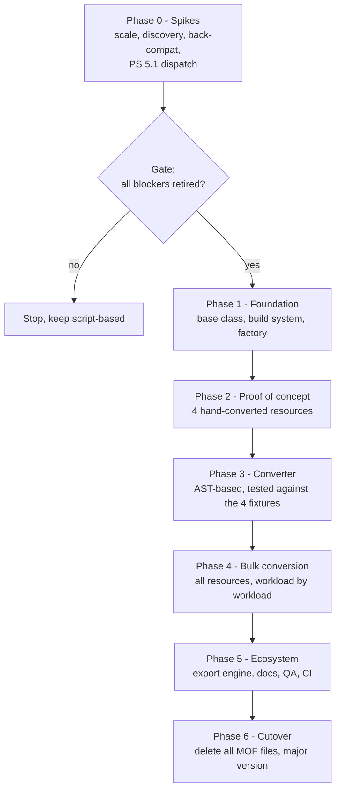
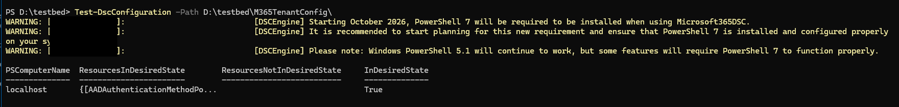
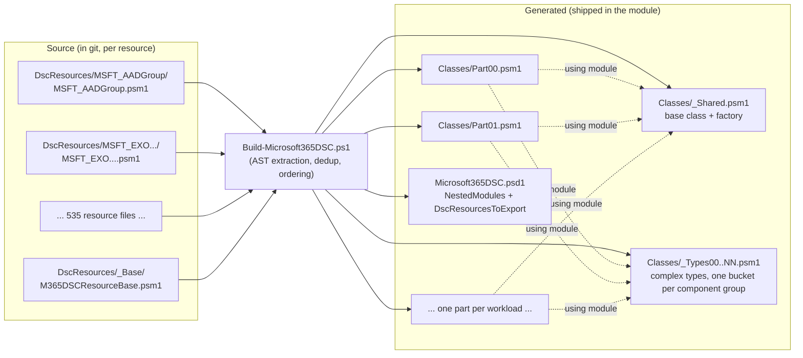
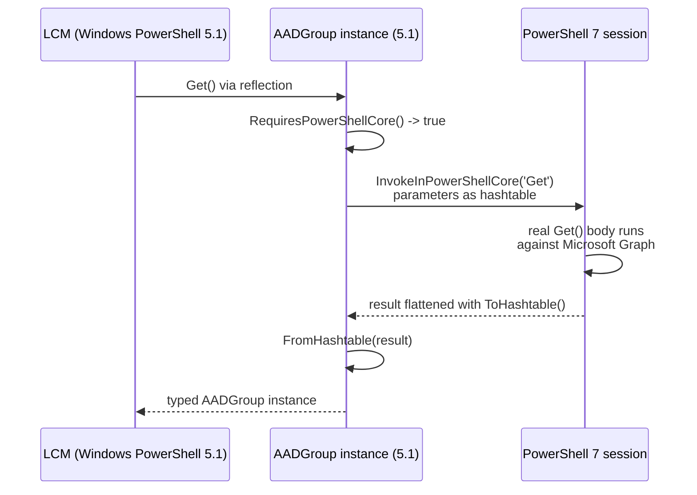
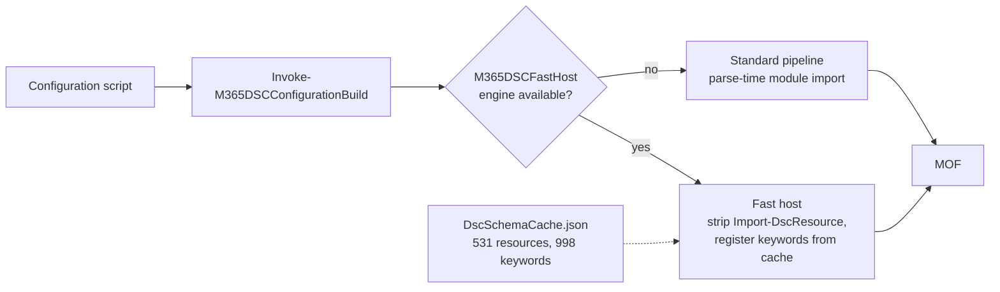

# From Script-Based to Class-Based: Rebuilding Every Microsoft365DSC Resource


<div style="position:inherit;padding-top:15px;"><span style="float:left;padding-left:15px;"><b>by <a href="https://www.linkedin.com/in/fabien-tschanz">Fabien Tschanz</a><br />
October 7th, 2026</b></span></div>

<br/>
<br/>

## Introduction

Microsoft365DSC ships more than 530 resource types across a dozen workloads, and until this release, every single one of them was a script-based DSC resource: a `.psm1` file with `Get-TargetResource`, `Set-TargetResource` and `Test-TargetResource` functions, plus a (semi-)hand-written `.schema.mof` file describing the schema. That design served the project for over seven years. With the October 2026 release, it is gone: all 530+ resources are now class-based DSC resources, the MOF schema files have been deleted, and the module integrates nicely with DSCv3.

This was the largest architectural change in the history of the project. It touched almost 450,000 lines of resource code, removed roughly 114,000 of them, and surfaced defects that had been sitting invisibly in the module for years. In this post, I will walk through why we made the change, how we approached an automated conversion at this scale, the numbers we measured along the way, and the discussions in the community that shaped the outcome. If you have never written a class-based DSC resource before, don't worry: the first section explains the difference with a real example from the module.

## Table of Contents

1. [What is the difference, actually?](#what-is-the-difference-actually)
2. [Why we did it](#why-we-did-it)
3. [The community discussion](#the-community-discussion)
4. [The engineering approach: measure before you migrate](#the-engineering-approach-measure-before-you-migrate)
5. [Issue #1: How DSC actually discovers class-based resources](#issue-1-how-dsc-actually-discovers-class-based-resources)
6. [Issue #2: Import time explodes at scale](#issue-2-import-time-explodes-at-scale)
7. [Issue #3: There is no $PSBoundParameters in a class](#issue-3-there-is-no-psboundparameters-in-a-class)
8. [Issue #4: The bug that passed every test](#issue-4-the-bug-that-passed-every-test)
9. [Keeping the LCM alive](#keeping-the-lcm-alive)
10. [Converting 530+ resources without going insane](#converting-530-resources-without-going-insane)
11. [What the conversion found in our own code](#what-the-conversion-found-in-our-own-code)
12. [Issue #5: Compiling a configuration became the slow part](#issue-5-compiling-a-configuration-became-the-slow-part)
13. [Rebuilding the examples on top of it](#rebuilding-the-examples-on-top-of-it)
14. [The rest of the toolchain](#the-rest-of-the-toolchain)
15. [The numbers](#the-numbers)
16. [What this means for you](#what-this-means-for-you)
17. [The effort behind it](#the-effort-behind-it)
18. [Wrapping up](#wrapping-up)

## What is the difference, actually?

A script-based DSC resource is really two files that have to agree with each other. The `.schema.mof` file declares the schema in MOF syntax - a language most PowerShell people never touch outside of DSC:

```mof
[ClassVersion("1.0.0.1"), FriendlyName("AADAttributeSet")]
class MSFT_AADAttributeSet : OMI_BaseResource
{
    [Key, Description("Identifier for the attribute set...")] String Id;
    [Write, Description("Maximum number of custom security attributes...")] UInt32 MaxAttributesPerSet;
    [Write, Description("Present ensures the policy exists..."), ValueMap{"Present","Absent"}, Values{"Present","Absent"}] string Ensure;
    ...
};
```

The `.psm1` file then declares the *same* properties again - three times, once per function - as parameters of `Get-TargetResource`, `Set-TargetResource` and `Test-TargetResource`. For `AADAttributeSet`, a resource with 13 properties, that meant 467 lines of code, most of it repeated parameter blocks. And nothing except discipline keeps the MOF and the three parameter blocks in sync. When they drift apart, DSC believes the MOF and the code believes the parameters, and you get bugs that are genuinely hard to reason about. For that exact reason, we implemented a CI pipeline check to let us know if those two files differed in any way. But of course it's easier if you don't have to maintain two separate files.

A class-based resource collapses all of that into one definition. The class *is* the schema:

```powershell
[DscResource()]
class AADAttributeSet : M365DSCResourceBase
{
    [DscProperty(Key)]
    [System.ComponentModel.Description('Identifier for the attribute set that is unique within a tenant...')]
    [System.String] $Id

    [DscProperty()]
    [ValidateRange(1, 500)]
    [System.Nullable[System.UInt32]] $MaxAttributesPerSet

    [DscProperty()]
    [ValidateSet('Present', 'Absent')]
    [System.String] $Ensure

    # ... authentication properties ...

    [AADAttributeSet] Get() { ... }
    [void] Set() { ... }
    [bool] Test() { ... }
}
```

Each property is declared exactly once. Validation like `[ValidateRange(1, 500)]` lives on the property. The property description - which feeds our generated documentation - lives on the property too, as a `[System.ComponentModel.Description]` attribute. The same resource is now 282 lines instead of 467, and there is no MOF file that can drift out of sync, because there is no MOF file at all.

## Why we did it

Three concrete problems drove this, and all three came out of GitHub issues rather than architectural aesthetics.

**The nested CIM problem.** Issue [#6120](https://github.com/Microsoft365DSC/Microsoft365DSC/issues/6120) documented that `Get-DscConfiguration` fails for any of our resources with nested complex properties, both through the classic LCM and through DSCv3, with `Could not infer CimType from the provided .NET type`. Script-based resources return plain hashtables, and the CIM serializer cannot infer types from them if the nesting level is > 2. Or it may omit those nested hashtables altogether. Class-based resources return typed instances, and the problem disappears structurally.

**Triple property definitions.** As raised in the original proposal ([#6202](https://github.com/Microsoft365DSC/Microsoft365DSC/issues/6202)), every property was defined four times: once in the MOF and once per `*-TargetResource` function. Beyond the maintenance burden, this is where an entire class of "MOF and psm1 drifted apart" bugs came from - more on what we found later in this post.

**The PowerShell 7 and DSCv3 future.** DSCv3 has no Local Configuration Manager, but it can drive class-based PowerShell resources through the `Microsoft.DSC/PowerShell` adapter running on PowerShell 7. Script-based MOF resources are a legacy path there. Combined with our Docker images and the C# core engine we shipped earlier this year, class-based resources are the piece that lets the whole module run cross-platform on PowerShell 7 - which is what we strived for with this release.

## The community discussion

This decision was not made in a vacuum, and it was not unanimous at the start. The discussion stretched over almost two years and three long issue threads, and I think it is worth showing both sides, because the concerns were legitimate.

The debate started in issue [#5433](https://github.com/Microsoft365DSC/Microsoft365DSC/issues/5433) in late 2024, which began as a dependency-installation bug and turned into a 42-comment strategy thread about the PowerShell 5.1 dependency. Users running PowerShell 7-only pipelines told us plainly that being pulled back to Windows PowerShell was "perplexing". At the same time, [@Borgquite](https://github.com/borgquite) - whose deep knowledge of the DSC platform shaped much of this discussion - made the strongest case *against* a rewrite, and I want to quote it fairly:

> "Switching from script-based to class-based is a classic time-consuming sink hole of programmers' time - a lot of work for no real benefit at the end for actual end-user SysOps / DevOps roles."

He also begged us - his word - to retain support for the classic LCM, because for hybrid environments that combine Microsoft 365 with on-premises Active Directory and Exchange, the PowerShell 5.1 LCM is "the only officially supported game out there", and DSCv3 includes only a fraction of its orchestration features. Both points were correct. My own position at the time was somewhere in the middle: "Rewriting everything to class-based resources would be a real pain, but it probably needs to happen sooner or later."

The formal proposal came in June 2025 with issue [#6202](https://github.com/Microsoft365DSC/Microsoft365DSC/issues/6202). Early concerns got resolved one by one: [@ykuijs](https://github.com/ykuijs) raised Pester testability of classes, which Borgquite confirmed is solved in Pester 5. [@salbeck-sit](https://github.com/salbeck-sit) raised the inability to distinguish "explicitly set to `$null`" from "not set" - a real limitation we accepted as a niche case, and I will explain why in the `$PSBoundParameters` section. In August 2025, after weeks of prototyping, I could report the breakthrough that made the whole thing viable - and indented-automation then contributed a detailed code review of the base class that directly improved the design that shipped (the per-type initialization tracking in `M365DSCResourceInfo` is a direct result of that review).

There was even a late twist: in February 2026, the question came up whether Microsoft's new unified Tenant Configuration Management API would make all of this moot. Our conclusion - shared by the people in the thread - was that it does not: it covers roughly 300 resource types against our 530+, requires a single app registration with no workload separation, and offers no arbitrary delta reporting. Microsoft365DSC stays, so it was worth investing in its foundation.

## The engineering approach: measure before you migrate

You do not convert so many resources on a hunch. The project was structured in phases, and the first phase was deliberately not a conversion at all - it was a series of spikes, each designed to kill the project cheaply if a hard blocker existed:



The four proof-of-concept resources in Phase 2 were chosen to span the difficulty range: `AADAttributeSet` (simple), `AADGroup` (complex types), `AADAccessReviewDefinition` (deeply nested complex types) and `IntuneSettingCatalogCustomPolicyWindows10` (the settings catalog shape). The converter in Phase 3 was then built *against those four known-good outputs as fixtures* - every converter change had to reproduce them byte-for-byte before it was allowed near the other resources.

The spikes earned their keep immediately, because two of them invalidated the original design. Let me walk through the four biggest problems in the order we hit them, in the same spirit as the settings catalog post: one issue at a time.

## Issue #1: How DSC actually discovers class-based resources

Our first attempt placed each class in its own file under `DscResources/MSFT_<Name>/`, mirroring the script-based layout. `Get-DscResource` found nothing. Not an error - just zero resources.

The reason lives in the PowerShell engine source (`CimDSCParser.cs`): DSC only looks for `[DscResource()]` classes in a module's `RootModule` and in the entries of `NestedModules`, exactly one level deep. There is no filesystem walk for classes; the `DscResources\*` directory scan that does exist only ever looks for `.schema.mof` files. On top of that, `DscResourcesToExport` in the manifest is mandatory - if it is absent, discovery returns immediately with zero resources - and each file is parsed in complete isolation, so a class in file A cannot see a class in file B at discovery time.

One more discovery rule cost us the most debugging time of the entire project, and I want it written down where search engines can find it: **if your module manifest has an explicit `FunctionsToExport` list, every class-based resource silently disappears from `Get-DscResource`.** Not an error, not a warning, just zero resources, on both PowerShell editions. The key must be absent or `'*'`. We measured this precisely:

| `FunctionsToExport` | `Get-DscResource` result |
| --- | --- |
| key absent | all resources found |
| `'*'` | all resources found |
| an explicit list | **0 resources, no error** |

> **[Image placeholder: Screenshot of a terminal showing `Get-DscResource -Module Microsoft365DSC` returning the full resource list, next to the manifest's commented-out `FunctionsToExport` line.]**

### The second manifest trap: `ScriptsToProcess`

There is a second manifest key that breaks class-based resources, and it is far nastier than the first one, because it leaves discovery completely intact. **If your manifest declares `ScriptsToProcess`, the LCM cannot instantiate your class-based resources.** `Get-DscResource` still lists every resource, so by every check you would think to run, the module looks healthy. Then you apply a configuration and get:

```text
Could not find the type of DSC resource class IntuneAccountProtectionLocalUserGroupMembershipPolicy.
    + FullyQualifiedErrorId : ClassTypeNotFound
```

or, through `Invoke-DscResource`, the equally unhelpful:

```text
The property 'DisplayName' cannot be found on this object. Verify that the property exists and can be set.
```

Reduced to a minimal two-class module, the two keys fail in completely different places:

| manifest key | `Get-DscResource` | `Invoke-DscResource` / LCM |
| --- | --- | --- |
| neither key present | all resources found | works |
| `FunctionsToExport` = explicit list | **0 resources, no error** | resource not found |
| `ScriptsToProcess` = any script | all resources found | **fails - "The property '&lt;Name&gt;' cannot be found on this object"** |


The mechanism is worth understanding, because the error message points nowhere near the cause. To run a class-based resource, DSC builds a small script in a fresh runspace that boils down to `using module "<path to your .psd1>"` followed by `[YourResource]::new()`, and takes the first object that comes back. With `ScriptsToProcess` present, that `using module` no longer surfaces the module's classes - the type does not resolve, nothing is returned, and DSC then dutifully assigns your configuration's property values onto `$null`. Hence a message about a missing property when the real failure was that the class never materialized.

The fix is to stop using the key. `ScriptsToProcess` only exists to run something in the caller's session before the module loads, and a nested module listed first does the same job without breaking class visibility:



```powershell
# Microsoft365DSC.psd1
#
# ScriptsToProcess = @(                          # breaks class instantiation under the LCM
#   'Import-M365DSCDllLoaderModule.ps1',
#   'Show-PwshWarning.ps1',
#   'Update-MaximumFunctionCount.ps1'
# )

NestedModules = @(
    'Modules/M365DSCInit.psm1',                  # runs the three scripts instead
    ...
)
```

with `M365DSCInit.psm1` doing nothing more than invoking them in order:

```powershell
& (Join-Path $PSScriptRoot '../Import-M365DSCDllLoaderModule.ps1' -Resolve)
& (Join-Path $PSScriptRoot '../Show-PwshWarning.ps1' -Resolve)
& (Join-Path $PSScriptRoot '../Update-MaximumFunctionCount.ps1' -Resolve)
```

The ordering matters: it has to be the first entry, because the DLL loader has to run before any class module that depends on the compiled assemblies is parsed.

What makes this one expensive to diagnose is that every cheap check passes. The module imports, `Get-DscResource` lists all 530+ resources, configurations compile to MOF without complaint - and then the LCM reports a missing class or a missing property. If you are building a class-based module and see `ClassTypeNotFound` for a resource you can plainly see in `Get-DscResource`, check your manifest for `ScriptsToProcess` before you look anywhere else.

## Issue #2: Import time explodes at scale

The original plan concatenated all 530+ classes into one big root module at build time. Spike 1 generated exactly that, all resources plus more than 470 complex-type classes with stub bodies, and measured a cold `Import-Module`:

| Layout | Import time | Discovery time |
| --- | --- | --- |
| Current, MOF-based (baseline) | **4.50 s** | 12.90 s |
| One consolidated module, PowerShell 7 | **41.1 s** | 13.3 s |
| One consolidated module, Windows PowerShell 5.1 | 39.6 s | 16.9 s |
| Split across 4 nested modules | 7.44 s | 10.10 s |
| **Split across 16 nested modules** | **6.95 s** | 11.95 s |
| Split across 32 nested modules | 8.92 s | 16.52 s |

41 seconds to import the module was obviously unshippable. Profiling showed the time was not parsing (0.47 s for the full set) but .NET type creation, which grows roughly with the *cube* of the number of classes in a single parse unit: 522 classes in one file import in 5.4 s, 772 in 21 s, 1007 in 41 s. We tried the obvious diets first - dropping every description attribute saved 9 of the 41 seconds, dropping `[ValidateSet]` saved nothing, removing the base class saved nothing. The only lever that works is splitting the parse unit.

So the shipping layout splits the generated classes across nested modules, grouped by workload, which lands at 6.95 s against the 4.50 s script-based baseline - a price we considered acceptable for what we get in return:



The per-resource source files stay in git, so diffs, history and pull requests remain per-resource, exactly as before. Only the shipped part files are generated. If you contribute a resource, you still edit one file in one folder - the build system does the rest.

## Issue #3: There is no $PSBoundParameters in a class

This one is the heart of the conversion, and the part where class-based resources are genuinely harder than script-based ones.

A script-based resource gets `$PSBoundParameters` for free: the set of parameters the caller actually passed. Microsoft365DSC leans on that heavily - almost 7'000 call sites across the module depend on it, because drift detection must only compare the properties a configuration actually specifies. A class has no such thing. PowerShell materializes *every* property on instantiation: value types become `0` or `$false`, reference types become `$null`. The class cannot natively tell "the user did not specify `MaxAttributesPerSet`" (which is an Int32) apart from "the user specified `0`".

Worse, the obvious workaround does not survive contact with the DSC engine. My first working prototype tracked assignments through PowerShell script properties - and it worked beautifully in every test, then returned empty objects the moment the real LCM drove it. The reason, which took weeks to isolate in the summer of 2025: **DSC populates class-resource instances by writing the CLR backing fields directly through reflection.** The PowerShell member layer - where any tracking logic would live - is never invoked. This is the "99%" breakthrough moment from issue #6202: once we understood that reflection is the transport, the design falls out of it.

The shipping mechanism has two halves:

1. **Value-type properties are nullable.** Every `[System.Boolean]` became `[System.Nullable[System.Boolean]]`, every `[UInt32]` became `[System.Nullable[System.UInt32]]`. Reflection cannot be observed, so nullability carries the signal instead: a property that is `$null` was not specified, anything else was. DSC accepts `Nullable[T]` on both editions and still reports the property as its underlying type. We of course verified this before committing to it.

2. **`GetBoundParameters()` on the base class** returns every DSC property that is not `$null`, which behaves identically whether the value arrived through reflection (from the LCM) or through direct assignment (from our export engine or tests). It is the drop-in replacement for `$PSBoundParameters` at all ~7'000 call sites.

The trade-off salbeck-sit called out in the proposal thread is real: you can no longer say "ensure this attribute is explicitly `$null`", because `$null` now means "not specified". No resource in the module relied on that distinction, so we accepted it. Documented, not hidden.

There is one behavioral consequence worth knowing as a user: a `[bool]` property set to `$false` in your configuration is now genuinely *specified*. The previous design may have silently dropped it from comparison and never reported drift on it. The new one reports drift. That is a correctness improvement, but if a configuration of yours suddenly reports drift on a `$false` value, this is why.

## Issue #4: The bug that passed every test

I want to tell this one in detail because it is the best argument I know for testing at the right boundary.

Our 530+ converted unit test suites all run inside the module's scope - they have to, because PowerShell class types are not visible outside the module that defines them. During the conversion, every suite went green, and everything looked done. Then we ran a resource through `Invoke-DscResource`, the way the real engine does, and got back empty strings for every property.

The cause was the interaction from Issue #3: an intermediate version of the base class still routed property access through a private backing store. Called from inside the module, the PowerShell member layer was engaged and everything worked. Called by the DSC engine, reflection wrote the CLR fields directly - a place the class never read - and read them back from a place the class never wrote:

| Path | Result of `Invoke-DscResource -Method Get` |
| --- | --- |
| Called from inside the module (like every unit test) | `Id='abc-123' DisplayName='resolved'` |
| Called through the DSC engine | `Id='' DisplayName=''` |

Every converted resource was silently non-functional under the LCM while passing its entire test suite. The fix was to make the property layer write through to the real CLR properties with no private store - and, more importantly, our QA suite now round-trips a resource through `Invoke-DscResource` on every run. That is the test that would have caught it, so now it exists.

## Keeping the LCM alive

Borgquite's plea did not go unanswered. The classic LCM runs on Windows PowerShell 5.1 only, and our module code is PowerShell 7-only - that combination is all except two of the script-based resources carried a total of 2,130 copies of the same shim block that relayed execution into PowerShell 7. The class-based design keeps that capability, but implements it once, in the base class:



Each generated method opens with a small guard: on PowerShell 7 it falls straight through to the real body with zero overhead; on 5.1 it relays into a PowerShell 7 session and rebuilds the typed result from a hashtable. Why hashtables on the wire? Because a class instance does not survive PowerShell remoting serialization - it comes back as a `Deserialized.AADGroup` that cannot be cast back, and serializing the full reflection graph of an instance actually threw `OutOfMemoryException` at depth 16 in our spikes. The flattened hashtable is 523 characters and depth-insensitive.

We also verified the thing I personally considered the highest breaking-change risk in the whole project: **existing configurations compile unchanged.** A `Configuration` block written against the old resources, including the MOF-style embedded instance syntax for complex properties, compiles identically against the class-based resources on both PowerShell editions:

```powershell
AADGroup 'MyGroup'
{
    DisplayName = 'Finance'
    Owners      = @(
        'owner-1'
    )
    ...
}
```

This is also why resource names did not change. For a class-based resource the class name *is* the resource name, so the classes are named `AADGroup`, not `MSFT_AADGroup` - and why complex types kept their `MSFT_MicrosoftGraph*` names. Every exported configuration from the previous release keeps compiling.

## Converting 530 resources without going insane

Hand-converting 530 resources was never an option; at even 10 resources a day that is almost two months of work. The conversion is done by `Convert-M365DSCResourceToClass.ps1`, and the single most important decision in that script is that it operates on the PowerShell **abstract syntax tree**, not on regular expressions.

An earlier regex-based prototype looked like it worked, and that is also what made it dangerous. Its failures were silent: the property regex read MOF array markers on the type instead of the name, so every array property quietly became a scalar; the variable rewrite `$ApplicationId` -> `$this.ApplicationId` had no word boundary, so `$ApplicationIdValue` silently became `$this.ApplicationIdValue`. With AST transformation, the converter walks real language elements - a `VariableExpressionAst` whose name matches a schema property becomes a `$this.` member access, the telemetry region becomes `$this.AddTelemetry('Get')`, the 2,130 shim blocks become the single base-class guard - and anything it does not positively recognize lands in a per-resource JSON report for human review instead of being guessed at.

The subtleties the AST approach caught earned it. My favorite: `Get-TargetResource` is called in three different shapes in the codebase, and they must convert differently. The export path calls it with a per-item key (`Get-TargetResource @params` inside a loop over all groups in a tenant), and rewriting that to a bare `$this.Get()` - the "obvious" conversion - would have made 18 resources silently export with a `$null` key, querying the workload with nothing. The converter distinguishes the shapes and emits `$this.GetForExport($params)` where the loop context requires it.

One small quality-of-life decision I want to highlight for contributors. Every resource source file opens with:

```powershell
# Editor-only: lets this file resolve [M365DSCResourceBase] when parsed on its own.
# Build-Microsoft365DSC.ps1 emits only the class extent, so this line is not shipped.
using module ..\_Base\M365DSCResourceBase.psm1
```

Without it, opening any resource in VS Code shows parser errors on the entire file. These come from the parser itself, not from PSScriptAnalyzer, so no editor setting can suppress them. With the line, a converted file parses with zero errors, and the build strips it structurally by emitting only the class text. A QA test enforces the zero-error parse per file, so no contributor ever has to stare at false red squiggles.

> **[Image placeholder: Side-by-side VS Code screenshot - a resource file with the two red parse errors on the left, the same file with the editor-only `using module` line and zero errors on the right.]**

## What the conversion found in our own code

Here is the part I did not expect when we started: converting to classes was, among other things, the most effective audit the codebase has ever had. A MOF tolerates almost anything silently. A class either compiles and validates, or it does not. The conversion surfaced defects that had been shipping for years:

- **16 resources could never say "Absent".** Their MOF declared `ValueMap{"Present"}` for `Ensure`, but their code assigns `'Absent'` on the not-found path. As a function, nothing validated a value assigned into a result hashtable, so it worked by accident. As a class property, the `[ValidateSet]` fired immediately. The MOFs were wrong; the code was right; the MOFs got fixed.
- **Two resources were silently invisible.** Our MOF-parsing schema generator split quoted ValueMap entries on their internal commas, so `ValueMap{"companyPortal,email"}` produced duplicate values - and DSC responds to a duplicate `[ValidateSet]` by silently dropping the entire resource from `Get-DscResource`. `IntuneDerivedCredential` had this defect.
- **112 unit tests constructed the wrong type.** Tests built complex values with `New-CimInstance -ClientOnly`, which validates neither the class name nor the property names. In 112 places, the class name in the test did not match the type the property actually declares. Nothing noticed, because nothing checked. A typed class cast checks.
- **93 drift tests were passing for the wrong reason.** Before the conversion work on the comparison engine, 93 tests asserted "drift detected" and got a `$true` that came from complex-object drift not being detected at all - the comparer fell through on unknown types and reported whatever the test wanted to hear. After the conversion and comparer fixes, that number is now 0 since we fixed everything.

This is the pattern throughout: the class conversion did not primarily *create* problems, it made existing ones loud. I will happily pay a two-second import penalty for that.

## Issue #5: Compiling a configuration became the slow part

Everything above is about loading resources. Compiling a configuration against them turned out to be a separate problem, which only became visible once every resource was converted to a class.

When PowerShell parses the `Import-DscResource -ModuleName Microsoft365DSC` line in a file, the DSC engine imports the module right there at parse time and builds a `DynamicKeyword` for every resource it finds. With script-based resources that work is reading MOF files, which is fairly cheap. With class-based resources it is .NET type creation again, the same curve from Issue #2, except now it runs on every single compile instead of once per session. One example configuration went from a second or two to somewhere between 30 and 90 seconds. Our example suite holds more than 1000 files, meaning that a full run was closer to a workday than to a coffee break.

The answer is great and insane at the same time: a fork of `PSDesiredStateConfiguration` that we maintain and publish as `M365DSC.PSDesiredStateConfiguration`, carrying an `M365DSCFastHost` tag that the module probes for. Its compile host changes two things:

- It strips `Import-DscResource` out of the script before the parser sees it, which removes the parse-time module import.
- It then registers the resource keywords from a persistent schema cache rather than discovering them from the module.

That cache ships inside the Microsoft365DSC module as `DscSchemaCache.json`, roughly 3.6 MB covering all >500 resources and ~1000 keywords. `Utilities/Build-Microsoft365DSC.ps1` regenerates it in a child process at the end of every build and stamps it with a fingerprint, which means a cache that no longer matches the built classes is detected instead of silently used.

| Compile path | What happens at compile time | Per configuration |
| --- | --- | --- |
| Standard pipeline | module imported at parse time, every keyword built from the classes | 30-90 s |
| Fast host | `Import-DscResource` stripped, keywords read from `DscSchemaCache.json` | around 0.2 s |

That is roughly 99 percent of the compile time gone. Compiling the full examples suite before we migrated to class-based resources was in the vicinity of ~20 minutes. With this change, we're down in the region of ~6 minutes, even faster than before. This developemtn was very unexpected for us since from the start on when we discovered these compile issues, we expected to publish the Microsoft365DSC module with the flaw and no way for us to improve the situation.



Users do not have to know any of this. `Invoke-M365DSCConfigurationBuild` wraps the whole decision and takes three modes on its `-Engine` parameter:

- `Auto` picks the fast host when the engine is installed and warns when it falls back.
- `FastHost` fails loudly instead of falling back.
- `Standard` always takes the classic route.

The examples QA gate, the workload integration pipelines and anyone compiling their own tenant configuration all go through the same wrapper.

> **[Image placeholder: Bar chart comparing compile time per configuration on the standard pipeline against the fast host, with the suite total of 1,169 examples underneath.]**

## Rebuilding the examples on top of it

After the compilation got cheap, we re-examined what was worth doing with the examples. Verifying every example against the real schema had never been practical before, and once a full run took only several minutes we pointed it at the whole `Examples` folder and looked at what came back.

Of course it couldn't be any different... Plenty came back. The examples had accumulated over years of hand editing, and the QA gate turned quiet inconsistencies into failures. Each resource carries up to three examples, and the rules they now have to satisfy are these:

- `1-Create.ps1` sets every configurable non-authentication property, with values a real tenant would plausibly hold.
- `2-Update.ps1` keeps the same coverage and differs from create in at least one property, with each differing line marked `# Updated Property`.
- `3-Remove.ps1` carries keys, mandatory properties, authentication and `Ensure = 'Absent'`, and nothing beyond that.
- Across all three, the keys are byte-identical, no property is undeclared, and no enum value is invalid.

Alongside the gate there is now `Utilities/Measure-M365DSCExampleCoverage.ps1`, a read-only analyzer that reports how much of each resource's schema its examples actually configure, whether the update example drifts, and what the remove example carries beyond the allowed set. It is the report we use to decide whether a workload is done. We also moved the examples to certificate authentication, which is what we recommend for all workloads (or if you're managing several workloads in one go), and reordered the authentication properties to the end of every block so the interesting part of an example comes first.

The generator that emits new examples got the same scrutiny because a fixed emitter is worth way more than a fixed example. It used to drop mandatory properties from the remove example, which made those examples uncompilable the moment `[DscProperty(Mandatory)]` started rendering as `Required`, it  placed `IsSingleInstance` last even though it is the key, and string placeholders were all called `FakeStringValue`, which told a reader nothing. Those are fixed at the source now.

> **[Image placeholder: Terminal output of `Measure-M365DSCExampleCoverage.ps1` showing a workload with coverage percentages, drift counts and an empty `UnknownProperties` column.]**

## The rest of the toolchain

A conversion of this size leaves a trail of supporting parts that all had to move with it. Here are a few of the most important ones:

**Schema generation reflects instead of parsing.** `SchemaDefinition.json` feeds the drift report and the generated documentation, and it used to be produced by a regular-expression walk over the `.schema.mof` files. There are no MOF files any more. The replacement, `Utilities/New-M365DSCSchemaFromClasses.ps1`, reflects over the built classes in a child process. The class metadata cannot drift from the code the way a hand-maintained MOF could using regular-expressions.

**Relations moved into C#.** Export dependency handling used to walk PowerShell objects and scaled quadratically with the number of exported instances. It now lives in the `Microsoft365DSC.Relations` assembly, along with `DependsOn` injection and the rewrite of the generated configuration. On the way we added a pile of new relations between resources, support for `like` and `notlike` in relation conditions, and `$_` as a condition subject so a rule can test a value inside a simple array rather than a property of an object. Several long-standing defects fell out of that work, including relations resolving even without `-IncludeDependencies` and hashtable-valued properties never matching because they were walked as a sequence.

**Helper functions became class methods.** A converted resource that still carried private helper functions kept them at module scope, which is a shared namespace across every resource in the same generated part file. Those helpers are moving to hidden class methods, where they belong to the instance and can reach `$this`. `Get-CompareParameters` went the same way and every call site follows the class now.

**CI knows about the build.** Every workflow that touches the module builds the class modules first, then the C# assemblies, then the schema cache. Validation gained two guards that the QA suite could not provide: no `.schema.mof` file may reappear under `DscResources`, and every resource file must declare a `[DscResource()]` class and carry no `*-TargetResource` functions. The old wiki workflow, which generated its pages from MOF files, was retired.

**New properties land in one place.** This one is mostly invisible but equally important or even more important regarding maintainability of the module. For example, adding `EwsAllowedAppIDs` to `EXOOrganizationConfig` or `CustomSecurityAttributes` to `AADUser` used to mean a MOF edit plus three parameter blocks. It is now a property declaration and, where a complex type is involved, a small class next to the resource. That's really it. No more three copies of the same property, no more MOF to keep in sync, no more chance of a typo in one of the three places.

## The numbers

A summary of the project in figures, because I know some of you scroll straight here:

| Metric | Value |
| --- | --- |
| Resources converted | 535 (every one) |
| Unit test suites converted | 534, ~5,500 tests |
| Resource code before | 455,474 lines / ~16 MB |
| Resource code after | 340,921 lines (−114,553 lines, ≈ 25%) |
| `.schema.mof` files deleted at cutover | 530+ |
| `$PSBoundParameters` call sites replaced | 6,949 |
| PowerShell edition shim blocks collapsed into one base-class guard | 2,132 |
| Script-scope cache variables moved to instance state | 1,707 `$Script:exportedInstance` sites alone |
| Complex-type classes generated and deduplicated | ~470, with 543 inheritance edges preserved |
| Cold import: consolidated single module (rejected) | 41.1 s |
| Cold import: shipping split layout | 6.95 s (baseline was 4.50 s) |
| Compile per configuration: standard pipeline | 30-90 s |
| Compile per configuration: fast host | around 0.2 s, roughly 99% less |
| Schema cache shipped with the module | ~3.6 MB, 531 resources, 998 keywords |
| Example files verified by the QA compile gate | 1,169 (hours down to minutes for a full run) |
| Time from proposal to release | June 20th, 2025 -> October 2026 |

## What this means for you

For most users, remarkably little. That was the design goal.

- **Your configurations keep working.** Existing `Configuration` scripts, including complex embedded-instance properties, compile unchanged. Resource names are identical.
- **PowerShell 7 is now a requirement**, as announced in July. The classic LCM on Windows PowerShell 5.1 continues to work through the built-in relay, so hybrid environments that depend on the LCM for drift remediation are not left behind.
- **`Get-DscConfiguration` with nested properties works now** (issue #6120) - typed classes fixed the CIM inference failure structurally.
- **Drift on `$false`:** a boolean you explicitly set to `$false` is now compared like any other specified value. If you see new drift reports on such properties, the report is correct.
- **Compiling is much faster with the fast host installed.** `M365DSC.PSDesiredStateConfiguration` comes down with the module dependencies, and `Invoke-M365DSCConfigurationBuild` picks it up on its own. Compiling a configuration the classic way still works and still produces the same MOF, it is simply the slow route now.
- **The examples are worth reading again.** Every resource has a create, an update and a remove example that compile, cover the schema and use certificate authentication.
- **For contributors:** you still edit one file per resource, in the same folder as before. It is now a class instead of three functions, roughly 40% shorter, and your editor shows zero errors while you work on it.

## The effort behind it

From the first comment in the PowerShell Core thread in November 2024 to this release is just under two years of discussion, prototyping and implementation. The proposal itself is from June 20th, 2025. What I want to emphasize is how much of that time was *not* writing the converter: the spikes that killed the consolidated-module layout, the weeks isolating why the LCM received empty objects, the discovery that two ordinary manifest keys - `FunctionsToExport` and `ScriptsToProcess` - silently break class-based resources in two entirely different ways - each of these findings is a paragraph in this post and was days or weeks in real life. The conversion itself, once the foundation was measured and solid, went from first hand-converted resource to all 535 converting and running cleanly in a matter of weeks.

None of it would have happened this way without the community. Borgquite's insistence on LCM support shaped the dispatch design; ykuijs and salbeck-sit stress-tested the proposal early; indented-automation's code review made the base class better; ricmestre root-caused and fixed a DSCv3 adapter bug upstream in the middle of it all. Thank you - this is what an open-source project is supposed to look like.

## Wrapping up

Microsoft365DSC now runs all 530+ class-based DSC resources: one definition per property, one shared base class instead of almost half a million lines of repeated boilerplate, no MOF files, native PowerShell 7, and a comparison engine that reports real drift instead of comfortable silence. Rewrites of this size are rightly treated with suspicion - Borgquite was correct that they are a classic sinkhole - and the way through was to measure everything, spike every risk before committing, and let an AST-based converter do the mechanical work while humans reviewed what it could not prove.

If you hit anything unexpected after upgrading, like a configuration that no longer compiles, new drift you believe is wrong, an import-time regression on your hardware, or anything else, the best thing you can do is open an issue with the resource name and details, and we'll dig in from there.

That's all for now. Thanks for staying with me through this blog, and especially thank you for using Microsoft365DSC!
